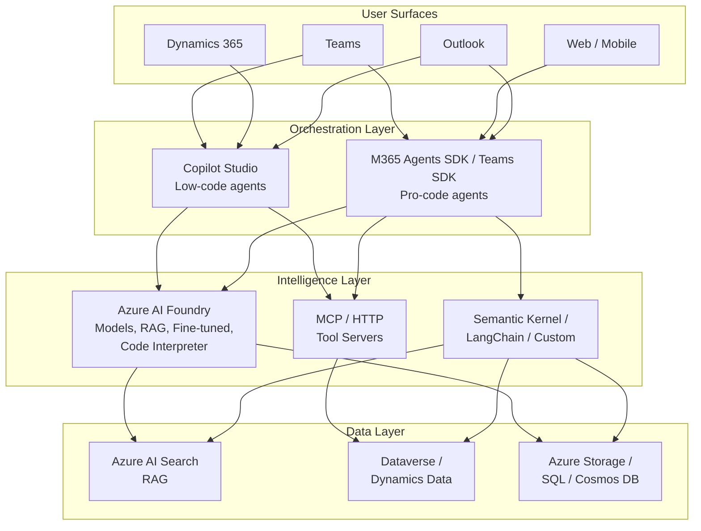
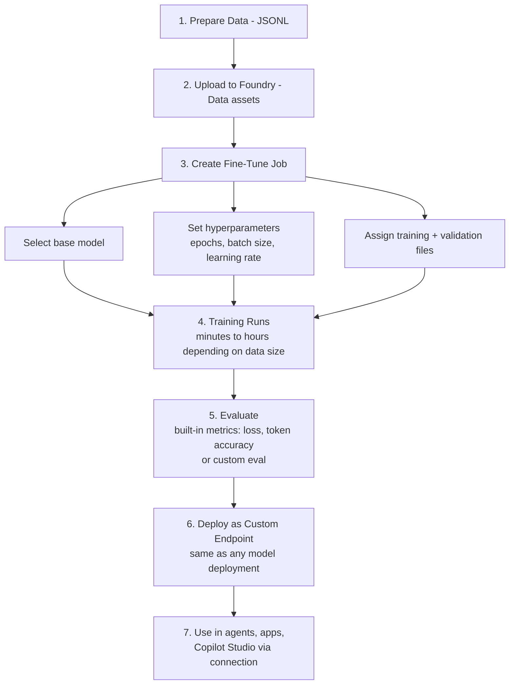
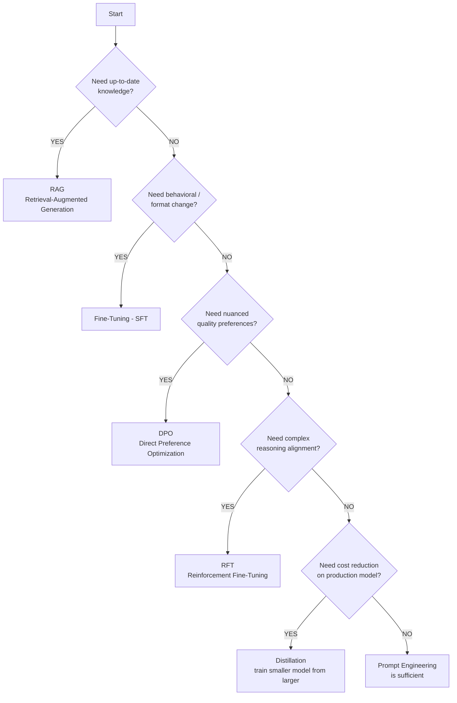
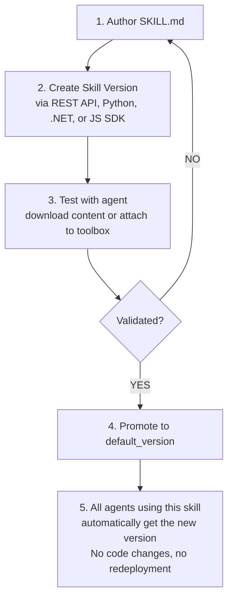
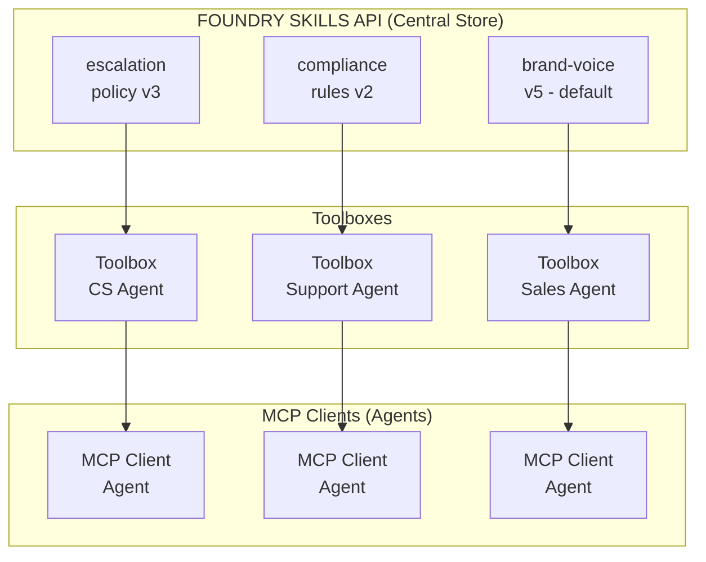
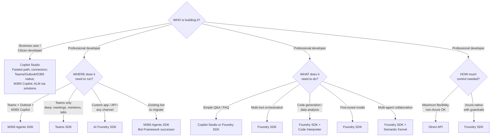

# Azure AI Foundry — Deep Dive Agenda

**Duration:** 60 minutes  
**Format:** Discussion + Demo-Ready Walkthrough  
**Audience:** Development team familiar with AI Foundry basics, Copilot Studio, and beginning Agents SDK exploration  
**Facilitator:** Brad Lawrence (Brad.Lawrence@microsoft.com)

---

## Agenda

| Time | Topic | Duration |
|------|-------|----------|
| 0:00 | Introductions & Goals | 5 min |
| 0:05 | Platform Integration Overview | 15 min |
| 0:20 | Model Fine-Tuning Options | 12 min |
| 0:32 | Foundry Skills & Toolboxes | 10 min |
| 0:42 | Agents: Foundry vs. Direct LLM Access | 13 min |
| 0:55 | Next Steps & Q&A | 5 min |

---

## 1. Introductions & Goals (5 min)

- Quick round-table on current progress / where teams are in their AI journey
- Confirm today's focus areas and any burning questions
- Set context: you've completed the workshop labs — today is about going deeper on architecture decisions

---

## 2. Platform Integration Overview (15 min)

### 2.1 AI Foundry ↔ Copilot Studio

**Integration Patterns:**

| Pattern | Description | When to Use |
|---------|-------------|-------------|
| **Direct Model Invocation (BYOM)** | Copilot Studio calls a Foundry-deployed model directly within its workflow | Need custom/fine-tuned model behavior in a low-code agent |
| **Azure Functions + Agent Flows** | Foundry models wrapped in Azure Functions; Copilot Studio orchestrates via connectors | Complex business logic, data transformation, multi-step processing |
| **MCP (Model Context Protocol)** | Shared tool servers callable by both Copilot Studio and Foundry agents | Cross-platform tool reuse, breaking down agent silos |
| **Custom Connectors** | Power Platform custom connectors (OpenAPI/Swagger) wrapping Foundry endpoints | Solution export, environment variable parameterization, ALM |

**Key architectural insight:** Copilot Studio is the **low-code orchestration layer** that can delegate heavy reasoning to Foundry-hosted models. The platforms connect via MCP, enabling agents built in different tools to share knowledge and abilities in real time.

> **Source:** [Integrating Azure AI Foundry with Microsoft Copilot Studio](https://dev.to/holgerimbery/triggering-the-backend-integrating-azure-ai-foundry-with-microsoft-copilot-studio-53ol)  
> **Source:** [Azure AI Foundry and Copilot Studio MCP Integration](https://nathanlasnoski.com/2025/09/08/azure-ai-foundry-and-copilot-studio-mcp-integration/)  
> **Source:** [Building a Scalable Multi-Agent AI Architecture](https://www.rbaconsulting.com/blog/from-copilot-studio-to-azure-ai-foundry-building-a-scalable-multi-agent-ai-architecture/)

---

### 2.2 AI Foundry ↔ Microsoft Teams

**Deployment paths into Teams:**

| Approach | Tech Stack | Best For |
|----------|-----------|----------|
| Copilot Studio → Publish to Teams + Outlook + M365 Copilot | Low-code | Business-owned agents, rapid prototyping |
| M365 Agents SDK → Teams channel | Pro-code (.NET/TS) | Complex multi-turn, deep Teams integration (mentions, reactions, meetings) |
| Teams SDK (formerly Teams AI Library) | Pro-code | Teams-only bots needing deep collaboration features |
| Foundry Agent → Azure Function → Bot Channel | Pro-code | When Foundry handles all reasoning, Teams is just the surface |

**Authentication:** SSO with Entra ID across Teams + agent backends. The M365 Agents SDK handles identity management at the platform layer (no more manually wiring AppId/AppPassword).

**Adaptive Cards:** All approaches support Adaptive Cards for rich UI in Teams (forms, tables, action buttons).

> **Source:** [M365 Agents SDK Migration Guidance](https://learn.microsoft.com/en-us/microsoft-365/agents-sdk/bf-migration-guidance)  
> **Source:** [Pick the right SDK for your Teams agent](https://microsoft.github.io/teams-sdk/teams/choosing-an-sdk/)  
> **Source:** [Ignite 2025: A Developer's Guide to Building Agents for M365](https://devblogs.microsoft.com/microsoft365dev/ignite-2025-a-developers-guide-to-building-agents-for-microsoft-365/)

---

### 2.3 AI Foundry ↔ Dynamics 365

**Integration points:**

| Surface | Integration Method | Example |
|---------|-------------------|---------|
| **Copilot in Dynamics** | Built-in (uses Foundry models) | Natural language queries over CRM data |
| **Custom agents in D365 UI** | Copilot Studio embedded in Dynamics apps | Agent that looks up customer history, suggests next-best-action |
| **Dataverse as shared data layer** | Connectors (Power Platform) or REST API (pro-code) | Agents read/write CRM entities, trigger workflows |
| **Advanced analytics** | Foundry models consume D365 data via Azure Synapse/Fabric | Forecasting, entity extraction, summarization over sales/finance data |

**Key point:** Dataverse is the common data fabric. Both Copilot Studio (native connectors) and Foundry agents (via API) can read/write the same customer, account, and opportunity records.

> **Source:** [Copilot Studio Architecture Overview](https://learn.microsoft.com/en-us/microsoft-copilot-studio/guidance/architecture-overview)  
> **Source:** [Microsoft AI Ecosystem Evolution](https://anandbg.com/blog/the-microsoft-ai-ecosystem-evolution)

---

### 2.4 Unified Architecture Diagram



---

## 3. Model Fine-Tuning Options (12 min)

### 3.1 Customization Spectrum

| Approach | Effort | Cost | Data Needed | Best For |
|----------|--------|------|-------------|----------|
| **Prompt Engineering** | Hours | $0 | 0 examples | First option always — system prompts, few-shot |
| **RAG** | Days | Low (search index) | Documents | Domain knowledge, policies, FAQs |
| **Fine-Tuning (SFT)** | Days-Weeks | Medium | 50–10,000+ examples | Behavior, tone, format specialization |
| **Direct Preference Optimization (DPO)** | Weeks | Medium-High | Preference pairs | Nuanced quality — "this response is better than that one" |
| **Reinforcement Fine-Tuning (RFT)** | Weeks | High | Business rules + reward signals | Complex reasoning, compliance, multi-step logic |
| **Distillation** | Days | Medium | Teacher model outputs | Compress large model behavior into smaller/cheaper model |

---

### 3.2 Fine-Tuning in Azure AI Foundry — Details

**Currently Supported Models (as of June 2026):**

| Model | Fine-Tune Methods | Status | Modality | Regions |
|-------|-------------------|--------|----------|---------|
| GPT-4o-mini (2024-07-18) | SFT | GA | Text to text | Standard, Global, Developer |
| GPT-4o (2024-08-06) | SFT, DPO | GA | Text + vision to text | Standard, Global, Developer |
| GPT-4.1 (2025-04-14) | SFT, DPO | GA | Text + vision to text | Standard, Global, Developer |
| GPT-4.1-mini (2025-04-14) | SFT, DPO | GA | Text to text | Standard, Global, Developer |
| GPT-4.1-nano (2025-04-14) | SFT, DPO | GA | Text to text | Standard, Global, Developer |
| o4-mini (2025-04-16) | RFT | GA | Text to text | Standard, Global |
| GPT-5 (2025-08-07) | RFT | GA (invitation only) | Text to text | Standard, Global, Developer |
| Ministral-3B (2411) | SFT | Public preview | Text to text | Global only |
| Qwen-32B | SFT | Public preview | Text to text | Global only |
| Llama-3.3-70B-Instruct | SFT | Public preview | Text to text | Global only |
| gpt-oss-20b | SFT | Public preview | Text to text | Global only |

**Training tiers:**

| Tier | Data Residency | Best For |
|------|---------------|----------|
| **Standard** | ✅ Guaranteed (same region) | Regulated workloads requiring data residency |
| **Global** | ❌ Data may leave region | Affordable pricing, faster queue times |
| **Developer (preview)** | ❌ No guarantees | Experimentation, price-sensitive; may be preempted |

**Notes:**
- GPT-5 RFT access is gated — contact your Microsoft account team for enrollment
- Open-source models (Ministral-3B, Qwen-32B, Llama-3.3-70B, gpt-oss-20b) require the new Foundry UI
- You can also fine-tune a previously fine-tuned model (format: `base-model.ft-{jobid}`)

> **Source:** [Customize a model with fine-tuning — Microsoft Foundry](https://learn.microsoft.com/en-us/azure/foundry/openai/how-to/fine-tuning)  
> **Source:** [Announcing New Fine-Tuning Models and Techniques in Azure AI Foundry](https://azure.microsoft.com/en-us/blog/announcing-new-fine-tuning-models-and-techniques-in-azure-ai-foundry/)  
> **Source:** [AI Foundry Model Catalog](https://ai.azure.com/catalog/models)

---

### 3.3 Data Format Requirements

**JSONL (JSON Lines) format — one example per line:**

```jsonl
{"messages": [{"role": "system", "content": "You are a loan advisor."}, {"role": "user", "content": "What's the rate for a 30-year mortgage?"}, {"role": "assistant", "content": "Current 30-year fixed rates start at 6.25% APR as of today."}]}
{"messages": [{"role": "system", "content": "You are a loan advisor."}, {"role": "user", "content": "Can I refinance with a 620 credit score?"}, {"role": "assistant", "content": "A 620 score meets the minimum for FHA refinancing, but conventional loans typically require 680+."}]}
```

**Requirements:**
| Requirement | Value |
|-------------|-------|
| File format | JSONL (UTF-8 encoded) |
| Max file size | 512 MB per file |
| Max total | ≤ 1 GB per resource |
| Min examples | 10 (absolute minimum, 50+ recommended) |
| Recommended | 500–10,000+ for production quality |
| Validation set | 10–20% of training data |
| Structure | `{"messages": [{"role": "...", "content": "..."}]}` |

> **Source:** [Customize a Model with Fine-Tuning — Microsoft Foundry](https://learn.microsoft.com/en-us/azure/ai/foundry/fine-tuning/)  
> **Source:** [Fine-Tuning in Azure AI Foundry: Practical Lessons](https://blog.bjdean.id.au/2025/11/fine-tuning-azure-ai-foundry-practical-lessons/)  
> **Source:** [GitHub: LLM-Fine-Tuning-Azure](https://github.com/Azure/LLM-Fine-Tuning-Azure)

---

### 3.4 Fine-Tuning Process in Foundry



---

### 3.5 Pricing (Approximate — 2025 rates)

| Component | Approximate Cost |
|-----------|-----------------|
| Training (GPT-4o-mini, 10K examples) | ~$65–100 per run |
| Training (GPT-4o, 10K examples) | ~$200–500 per run |
| Hosting fine-tuned model | Hourly rate (varies by model size) |
| Inference (per token) | Higher than base model, but shorter prompts offset |
| Developer tier (discounted) | Available for experimentation |

> **Important:** Fine-tuning customers must onboard by March 31, 2026 for continued GPT-4o/4o-mini training access. Inference support extends into 2027+.

> **Source:** [How to Create Sizing Plans for Custom Models in Microsoft Foundry](https://ridilabs.net/post/2026/04/12/How-to-Create-Sizing-Plans-for-Custom-Models-in-Microsoft-Foundry-Fine-Tuning-GPT-Models-from-the-Catalog-for-Specific-Use-Cases.aspx)  
> **Source:** [Azure AI Foundry Deep Dive: Custom Model Training](https://chandanbhagat.com.np/azure-ai-foundry-deep-dive-series-part-4-custom-mo/)

---

### 3.6 Decision Framework



**When Fine-Tuning makes sense:**

✅ Good fit:
- Consistent structured output (always return JSON in a specific schema)
- Domain terminology the base model consistently gets wrong
- Reducing prompt length (bake system instructions into the model weights)
- Specific tone/persona that can't be achieved via prompting alone
- Regulatory requirement for deterministic-style behavior

❌ Usually better with RAG:
- Factual knowledge that changes over time (policies, rates, product info)
- Large document collections (employee handbook, compliance docs)
- Data the model shouldn't memorize (PII, sensitive business data)

❌ Don't fine-tune for:
- Adding knowledge the model doesn't have (use RAG)
- One-off formatting needs (use prompt engineering)
- Fixing rare edge cases (add few-shot examples in prompt)

---

## 4. Foundry Skills & Toolboxes (10 min)

### 4.1 What Are Skills?

Skills are **versioned, centrally managed behavioral guidelines** authored as `SKILL.md` files and stored in Foundry through the Skills API. They decouple instructions, policies, and guardrails from agent code — enabling update-without-redeploy across all agents that reference them.

**The problem they solve:** When you have 5-10 agents that all need to follow the same escalation policy, compliance rules, or response templates, embedding those in each agent's system prompt creates duplication. When the policy changes, you redeploy every agent. Skills let you update once, and all agents pick up the change.

### 4.2 Skill Format (SKILL.md)

Skills follow the [Agent Skills specification](https://agentskills.io) — Markdown with YAML front matter:

```markdown
---
name: escalation-policy
description: Defines when and how to escalate customer issues to a human agent.
---

# Escalation Policy

## Rules

- Escalate immediately if the customer mentions legal action or regulatory complaint
- Escalate if sentiment is negative for 3+ consecutive turns
- Escalate if the request involves account closure or fraud
- Escalate if the agent cannot resolve after 2 attempts

## Escalation Response Template

"I want to make sure you get the best help possible. Let me connect you
with a specialist who can assist further. Please stay on the line."

## What NOT to Do

- Never tell the customer "I can't help you"
- Never disclose internal escalation criteria
- Never promise a specific resolution timeline
```

**YAML front matter requirements:**

| Field | Required | Rules |
|-------|----------|-------|
| `name` | Yes | Lowercase, numbers, hyphens only. Max 64 chars. Pattern: `^[a-z0-9]([a-z0-9\-]*[a-z0-9])?$` |
| `description` | Yes | One-liner shown in skill listings. Max 1,024 chars. |
| Body | Yes | Free Markdown — becomes the injected instructions |

**File organization:** Each skill lives in its own subdirectory under the agent root (e.g., `escalation-policy/SKILL.md`).

> **Source:** [Use skills with Microsoft Foundry agents (preview)](https://learn.microsoft.com/en-us/azure/foundry/agents/how-to/tools/skills)  
> **Source:** [Agent Skills specification](https://agentskills.io)

---

### 4.3 Skills Lifecycle



**Versioning model:**
- Every update creates a **new immutable version**
- The parent skill tracks a `default_version` pointer
- You can pin agents to a specific version or follow default
- Full version history is preserved for audit/compliance

---

### 4.4 Two Delivery Modes

| Mode | How It Works | Best For |
|------|-------------|----------|
| **Attach to Toolbox** | Skills appear alongside tools via MCP protocol. Any MCP client calls `resources/list` to discover skills, then `resources/read` to download content | Multi-agent environments; cross-platform (GitHub Copilot, Claude, custom agents) |
| **Download into Agent** | Agent code fetches skill content at runtime and injects it into session context (system prompt) | Hosted agents; simpler setups where you control the agent directly |

**Toolbox-based discovery** follows the [Skills extension for MCP (SEP-2640)](https://github.com/modelcontextprotocol/modelcontextprotocol/pull/2640) — skills appear as MCP Resources.

---

### 4.5 SDK Examples

**Python — Create and attach a skill:**

```python
from azure.ai.projects import AIProjectClient
from azure.ai.projects.models import ToolboxSkillReference

project = AIProjectClient(endpoint=endpoint, credential=credential)

# Create a skill version
skill_version = project.beta.skills.create_version(
    name="escalation-policy",
    content=open("escalation-policy/SKILL.md").read(),
    description="When and how to escalate customer issues"
)
print(f"Created skill version: {skill_version.version}")

# Attach to a toolbox (makes it discoverable via MCP)
toolbox_version = project.beta.toolboxes.create_version(
    name="customer-service-toolbox",
    description="Tools and skills for customer service agents",
    tools=[...],  # function tools
    skills=[
        ToolboxSkillReference(name="escalation-policy"),  # follows default version
        ToolboxSkillReference(name="compliance-rules", version="v2"),  # pinned
    ],
)
```

**.NET — Create and attach a skill:**

```csharp
#pragma warning disable AAIP001

// Create a skill version
var skillContent = File.ReadAllText("escalation-policy/SKILL.md");
var skillVersion = skillsClient.CreateSkillVersion(
    name: "escalation-policy",
    content: skillContent,
    description: "When and how to escalate customer issues"
);

// Attach to a toolbox
ToolboxSkillReference skillRef = new("escalation-policy");
ToolboxVersion toolboxVersion = toolboxClient.CreateToolboxVersion(
    name: "customer-service-toolbox",
    tools: [...],
    skills: [skillRef],
    description: "Tools and skills for customer service agents"
);
```

**REST API — Create a skill version:**

```http
POST {endpoint}/skills/escalation-policy/versions?api-version=v1
Authorization: Bearer {token}
Content-Type: application/json

{
  "description": "When and how to escalate customer issues",
  "content": "---\nname: escalation-policy\ndescription: ...\n---\n# Escalation Policy\n..."
}
```

> **Source:** [Use skills with Microsoft Foundry agents (preview)](https://learn.microsoft.com/en-us/azure/foundry/agents/how-to/tools/skills)  
> **Source:** [Microsoft Build 2025: AI Foundry Agent Service GA](https://pulseaisolutions.com/microsoft-build-2025-recap-ai-agents-azure-ai-foundry-and-developer-tools-with-complete-release-timeline/)

---

### 4.6 Skills vs. Other Mechanisms

| Mechanism | What It Contains | Update Requires | Shared Across Agents | Versioned |
|-----------|-----------------|-----------------|---------------------|-----------|
| **System prompt** | Persona + fixed instructions | Code redeploy | ❌ Copy/paste | ❌ |
| **Skills** | Behavioral guidelines, policies, checklists | API call (no redeploy) | ✅ Central reference | ✅ Immutable versions |
| **Tools (functions)** | Actions — API calls, calculations, data queries | Code redeploy | ✅ Via toolbox | ❌ (per deployment) |
| **RAG / Knowledge** | Factual data, documents, FAQs | Index update | ✅ Via search index | ❌ (index refresh) |
| **Fine-tuning** | Model behavior weights | Retrain + redeploy model | ✅ Via deployment | ✅ (model versions) |

---

### 4.7 Practical Use Cases for Skills

| Skill Name | Content | Why a Skill (vs. prompt) |
|------------|---------|--------------------------|
| `escalation-policy` | When to hand off to human, response templates | Updated by ops team without dev involvement |
| `compliance-guidelines` | Regulatory language requirements, PII handling rules | Must be consistent across all 12 agents; audit trail needed |
| `brand-voice` | Tone, forbidden phrases, formatting standards | Marketing updates quarterly; no dev cycle needed |
| `code-review-checklist` | Security checks, performance patterns, naming conventions | Shared across code review + PR summary agents |
| `data-classification` | How to handle PII, confidential vs. public data | Legal team manages; agents consume |
| `product-knowledge` | Current product names, features, pricing tiers | Sales team updates; all customer-facing agents get it instantly |

---

### 4.8 Architecture: Skills in Multi-Agent Systems



**Key points:**
- Skills are stored **once** in the Foundry project
- Multiple toolboxes can reference the same skill
- Multiple agents consume toolboxes via MCP
- Updating a skill version + promoting to default propagates to all agents **without any code changes**

---

### 4.9 Current Status & Limitations

| Aspect | Status |
|--------|--------|
| Skills API | **Public preview** (as of May 2025) |
| SDK Support | REST, Python, .NET, JavaScript — all GA-quality |
| Toolbox attachment | Preview — follows MCP SEP-2640 |
| Cross-project references | ❌ Not supported (skills must be in same Foundry project) |
| Content format | Markdown only (SKILL.md) |
| Max content size | Not documented; ZIP upload supported for larger skills |
| Copilot Studio integration | Not directly supported yet (use via MCP toolbox) |

> **Source:** [Use skills with Microsoft Foundry agents (preview)](https://learn.microsoft.com/en-us/azure/foundry/agents/how-to/tools/skills)  
> **Source:** [MCP Skills Extension (SEP-2640)](https://github.com/modelcontextprotocol/modelcontextprotocol/pull/2640)  
> **Source:** [Build Your First Agent with Azure AI Agent Service Workshop](https://microsoft.github.io/build-your-first-agent-with-azure-ai-agent-service-workshop/)

---

## 5. Agents: Foundry vs. Direct LLM Access (13 min)

### 5.1 Why Agents Over Direct API Calls?

| Concern | Direct LLM API | Agent Framework |
|---------|---------------|-----------------|
| **Orchestration** | You build it (loops, retries, routing) | Framework handles tool-call loops automatically |
| **Tool calling** | Manual JSON Schema → parse response → call function → re-send | Declarative tool registration, automatic dispatch |
| **Memory** | You manage conversation history, context windows | Built-in conversation management, token budgeting |
| **Multi-step reasoning** | You code each step | Model decides next action autonomously |
| **Grounding** | You implement RAG pipeline | Built-in connections to Azure AI Search, Bing, custom data |
| **Code execution** | You run sandboxed code yourself | Code Interpreter: agent writes + runs Python |
| **Observability** | You instrument logging | Built-in tracing, evaluation, A/B testing |
| **Safety** | You implement content filtering | Azure Content Safety integrated at platform level |
| **Scaling** | You manage compute, rate limits | Platform handles throttling, queueing, scaling |
| **Multi-agent** | You wire agent-to-agent communication | Emerging: multi-agent orchestration via Foundry + Semantic Kernel |

---

### 5.2 What Foundry Agents Provide Specifically

| Capability | Details |
|------------|---------|
| **Managed tool calling** | Define functions (JSON Schema), model decides when to invoke them |
| **Grounding with data** | Connect to Azure AI Search, Bing, SharePoint, custom sources |
| **Code Interpreter** | Agent can write and execute Python for data analysis, chart generation |
| **File handling** | Upload documents, agent processes them in context |
| **Evaluation framework** | A/B test agent behaviors, track quality metrics over time |
| **Enterprise security** | Entra ID, VNET integration, content safety, data residency, RBAC |
| **Multi-agent orchestration** | Compose specialized agents (via Semantic Kernel or Agents SDK) |
| **Deployment options** | REST API, Teams, Copilot Studio, custom apps |

---

### 5.3 Where to Build — Decision Matrix

| Platform | Builder | Strengths | Limitations |
|----------|---------|-----------|-------------|
| **Copilot Studio** | Citizen dev / IT Pro | Fastest to deploy; native Teams/Outlook/D365/Power Platform; M365 Copilot; built-in connectors; ALM via solutions | Limited custom orchestration; less control over model behavior; per-message pricing |
| **AI Foundry SDK (Python/.NET)** | Pro developer | Full control; custom orchestration; function calling; fine-tuned models; Code Interpreter; evaluation | More setup; you manage deployment; need Azure subscription |
| **M365 Agents SDK** | Pro developer | Multi-channel (Teams + Outlook + Copilot); replaces Bot Framework; Bring Your Own AI stack | Newer SDK, still evolving; primarily for M365 surfaces |
| **Teams SDK** | Pro developer | Deepest Teams integration (meetings, mentions, reactions, tabs) | Teams-only; less cross-platform |
| **Direct API** | ML engineer | Maximum flexibility; any cloud/on-prem; any model | You build everything (orchestration, safety, memory, tools) |

---

### 5.4 M365 Agents SDK — Key Points (Bot Framework Successor)

| Aspect | Old Bot Framework | M365 Agents SDK |
|--------|------------------|-----------------|
| Focus | Message/dialog chatbots | AI-first, action-oriented agents |
| Channels | Primarily Teams + Web Chat | Teams, Outlook, M365 Copilot, Web |
| AI Integration | LUIS, QnA Maker (deprecated) | Bring your own: Semantic Kernel, Foundry, OpenAI, LangChain |
| Serialization | Newtonsoft.Json | System.Text.Json |
| Auth | Manual AppId/AppPassword | Platform-managed identity |
| Architecture | Monolithic bot logic | Two-layer: Business Logic ↔ Deployment/Operations |
| Activity Protocol | Yes | Yes (shared with Teams SDK) |

**Migration note:** Core packages map directly (`Microsoft.Bot.Builder` → `Microsoft.Agents.Builder`). Adaptive Dialogs are deprecated.

> **Source:** [M365 Agents SDK Migration Guidance (.NET)](https://learn.microsoft.com/en-us/microsoft-365/agents-sdk/bf-migration-dotnet)  
> **Source:** [M365 Agents SDK Overview](https://learn.microsoft.com/en-us/microsoft-365/agents-sdk/bf-migration-guidance)  
> **Source:** [Why M365 Agents SDK Should Be on Your Radar](https://www.koskila.net/Why-m365-agents-sdk-should-be-on-your-radar)  
> **Source:** [Microsoft Teams SDK Guidance — Fall 2025](https://www.voitanos.io/blog/microsoft-teams-sdk-evolution-2025/)

---

### 5.5 Agent Use Cases — Discussion Starters

| Use Case | Why Agent > Direct API | Recommended Platform |
|----------|------------------------|---------------------|
| **Customer support with tool access** | Agent decides which tools to call based on conversation context; handles multi-turn | Copilot Studio (simple) or Foundry SDK (complex) |
| **Document processing pipeline** | Multi-step: extract → validate → route → respond; agent manages state | Foundry SDK + Code Interpreter |
| **Internal knowledge Q&A** | RAG + citation + follow-up clarification = agent pattern | Copilot Studio (quick) or Foundry SDK (custom ranking) |
| **Approval workflows** | Agent manages branching logic, calls APIs, waits for human input | Copilot Studio + Power Automate |
| **Data analysis / reporting** | Agent writes Python, generates charts, summarizes findings | Foundry SDK + Code Interpreter |
| **Multi-system orchestration** | Agent coordinates across CRM, ERP, email, calendar | Foundry SDK or M365 Agents SDK |
| **Compliance review** | Deterministic rules + LLM reasoning; audit trail required | Foundry SDK (fine-tuned model + guardrails) |

---

### 5.6 Decision Tree



---

## 6. Next Steps & Q&A (5 min)

### Recommended Actions

1. **Identify 1-2 pilot use cases** — Map to the decision tree above
2. **Assess fine-tuning candidates** — Is there a behavior/format gap that prompting alone can't solve? Collect example data.
3. **Choose integration pattern** — Based on team skills and target surfaces (Teams? D365? Custom app?)
4. **Schedule hands-on session** — Work through a pilot with your actual data/scenario

### Reference Materials

| Resource | Link |
|----------|------|
| AI Foundry Documentation | https://learn.microsoft.com/en-us/azure/ai-studio/ |
| Fine-Tuning How-To | https://learn.microsoft.com/en-us/azure/ai/foundry/fine-tuning/ |
| M365 Agents SDK Docs | https://learn.microsoft.com/en-us/microsoft-365/agents-sdk/ |
| Teams SDK (choose your SDK) | https://microsoft.github.io/teams-sdk/teams/choosing-an-sdk/ |
| Copilot Studio Architecture | https://learn.microsoft.com/en-us/microsoft-copilot-studio/guidance/architecture-overview |
| MCP Specification | https://modelcontextprotocol.io/specification/2025-03-26/ |
| Fine-Tuning GitHub Repo | https://github.com/Azure/LLM-Fine-Tuning-Azure |
| Workshop Labs (hands-on) | https://github.com/bradrlaw/agent-modernization-workshops |

---

## Facilitator Notes

- This audience has completed Labs 01-03 (Copilot Studio + Foundry SDK + .NET)
- They're currently exploring the Agents SDK (Bot Framework successor)
- Keep discussion practical — they want to know "where should we build what"
- Be prepared to show:
  - Foundry portal fine-tuning UI (model catalog → fine-tune wizard)
  - Tool-calling demo from Lab 03 (Python or .NET version)
  - MCP server from Lab 02 as a cross-platform integration example
  - Copilot Studio → Teams publish flow
- Key takeaway to drive home: **start with Copilot Studio for rapid validation, graduate to Foundry SDK/Agents SDK when complexity demands it**
