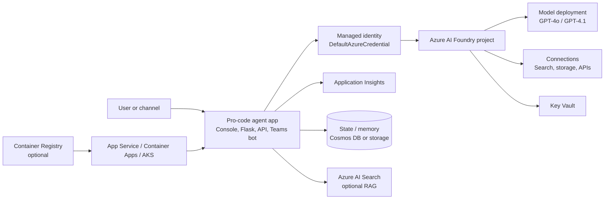
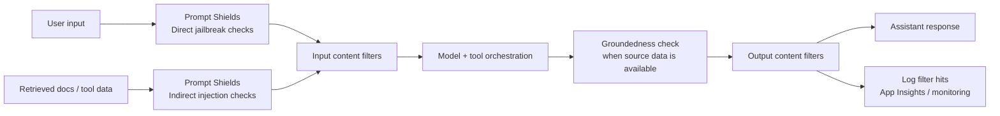
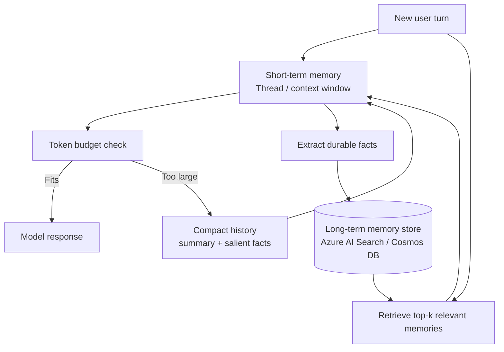

# Lab 03 – Azure AI Foundry: Build a Pro-Code Virtual Banking Assistant

## Overview

Build the **same Virtual Banking Assistant** from Lab 02 — but this time using
**Python code** and the **Azure AI Foundry Agent Service SDK**. This lab
demonstrates the pro-code path: full control over agent logic, tools, knowledge
grounding, and deployment.

The agent has the same six capabilities as Lab 02:

| # | Capability | Implementation |
|---|---|---|
| 1 | Get Account Balance | Python function tool → JSON data |
| 2 | Recent Transactions | Python function tool → JSON data |
| 3 | List Accounts | Python function tool → JSON data |
| 4 | Customer Profile | Python function tool → JSON data |
| 5 | Loan Rates | Python function tool (simulated API) |
| 6 | Loan Calculator | Python function tool (math) |

### Lab 02 vs Lab 03 — Side-by-Side

| Aspect | Lab 02 (Low-Code) | Lab 03 (Pro-Code) |
|---|---|---|
| Platform | Copilot Studio | Azure AI Foundry + OpenAI SDK |
| Language | No code / Power Fx | Python |
| Data store | Dataverse tables | JSON files (in-memory) |
| Data queries | Power Automate flows | Python function tools |
| External API | REST API tool (OpenAPI) | Python function tool |
| Knowledge | Copilot Studio knowledge source | System prompt + FAQ data |
| Orchestration | Managed generative orchestration | OpenAI function calling |
| Test interface | Copilot Studio test pane | Console chat client |
| Web UI | Teams channel | Flask web app + Teams (stretch) |
| Deployment | Managed (SaaS) | Azure Container Apps |

---

## Learning Objectives

By the end of this lab you will be able to:

- Create an Azure AI Foundry project and deploy a model
- Build an agent using the **Azure AI Foundry SDK** with OpenAI function calling
- Define **function tools** with JSON Schema that the model calls automatically
- Implement a **tool-call dispatch loop** that executes tools and returns results
- Build an interactive **console chat client** with multi-turn conversation
- (Stretch) Deploy to **Azure Container Apps** with a web chat interface
- (Stretch) Publish to **Microsoft Teams** via Azure Bot Service

---

## Prerequisites

| Requirement | Details |
|---|---|
| Azure subscription | Non-production, with contributor access |
| Azure AI Foundry | Project created with a deployed model (GPT-4o recommended) |
| Python 3.10+ | With pip and venv |
| Azure CLI | Installed and logged in (`az login`) |
| Git | For cloning the repository |

> 🆕 **Need an Azure subscription?** You have several options:
>
> | Option | Cost | AI Foundry + GPT-4o? |
> |---|---|---|
> | [Azure free trial](https://azure.microsoft.com/free/) | $200 credit for 30 days | ⚠️ GPT-4o may require pay-as-you-go upgrade |
> | Pay-as-you-go subscription | ~$1–5 for this lab | ✅ Full access |
> | Visual Studio Enterprise benefit | Included monthly credits | ✅ Full access |
> | M365 Dev tenant (Lab 02) | Free, but no Azure | ❌ Separate Azure sub needed |
>
> The **Azure free trial** is sufficient to set up AI Foundry and deploy a model.
> If GPT-4o is not available on the free tier, converting to pay-as-you-go costs
> only a few dollars for the entire lab (~$0.0025 per 1K input tokens).
>
> If you already set up an M365 Dev tenant for Lab 02, you can attach your Azure
> subscription to that tenant for a unified environment.
>
> For enterprise environments, see the
> [environment checklist](../../docs/environment-checklist.md#a2-azure-subscription--ai-foundry-required-by-week-3).

---

## Lab Contents

```
lab03-foundry-agent/
├── README.md                     # This file — full walkthrough
├── src/
│   ├── agent.py                  # Agent config, tool schemas, chat loop
│   ├── tools.py                  # 7 function tool implementations
│   ├── chat_console.py           # Interactive console chat client (LLM path)
│   ├── chat_console_clu.py       # Console client using CLU (no LLM path)
│   ├── clu_client.py             # CLU REST API client + entity resolution
│   ├── chat_web.py               # Flask web UI (stretch goal)
│   ├── requirements.txt          # Python dependencies
│   └── .env.example              # Environment variable template
├── clu/
│   ├── README.md                 # CLU alternate path guide
│   └── banking-assistant-clu.json # Importable CLU project definition
├── data/
│   ├── customers.json            # 3 demo customer profiles
│   ├── accounts.json             # 7 accounts across customers
│   ├── transactions.json         # 20 sample transactions
│   └── banking-faq.txt           # FAQ for knowledge grounding
├── web/
│   └── index.html                # Chat UI frontend (stretch goal)
├── deploy/
│   ├── Dockerfile                # Container image
│   └── deploy.sh                 # Azure Container Apps deployment
├── teams/
│   └── setup-guide.md            # Teams channel setup (stretch goal)
└── tests/
    └── test_tools.py             # Unit tests for function tools
```

> 🔀 **CLU Alternate Path:** If your organization restricts LLM usage, see
> [`clu/README.md`](clu/README.md) for a deterministic approach using Azure AI
> Language CLU for intent detection — no GPT model required.

---

## Lab Steps

### Step 1: Set Up Azure AI Foundry Project

> 💡 This lab targets the **new Foundry experience** (Foundry Projects). If you
> see a toggle at the top of ai.azure.com for "New" vs "Classic", select **New**.
> Classic hub-based projects are being retired (March 2027).

1. Open the [Azure AI Foundry portal](https://ai.azure.com)
2. Ensure you're in the **New** experience (toggle at the top of the page)
3. Click **+ New project**
4. Configure your project:
   - **Project name**: `banking-assistant`
   - **Region**: Choose a region close to you with GPT-4o availability
5. Click **Create**

> 💡 The new experience creates a **Foundry Project** (hub-less, single resource)
> instead of the classic Hub + Project hierarchy. This is simpler and is where
> Microsoft is investing all new features.

#### 1.1 Deploy a Model

1. In your project, go to **Models + endpoints** (left navigation)
2. Click **+ Deploy model** → **Deploy base model**
3. Select **gpt-4o** (or gpt-4.1 if available)
4. Configure:
   - **Deployment name**: `gpt-4o` (use this exact name to match `.env.example`)
   - **Deployment type**: Standard
   - **Tokens per minute rate limit**: 30K+ recommended for testing
5. Click **Deploy**

#### 1.2 Get Your Project Endpoint

1. Go to your project's **Overview** page
2. Find the **Project endpoint** (format:
   `https://<resource>.services.ai.azure.com/api/projects/<project>`)
3. Copy it — you'll need this in Step 2

> 💡 In the new Foundry experience, this is called the **Project endpoint**
> (not a connection string). You can also find it under **Settings** → **Properties**.

---

### Step 2: Set Up Python Environment

1. Clone the repository and navigate to the lab:

   ```bash
   git clone https://github.com/bradrlaw/agent-modernization-workshops.git
   cd agent-modernization-workshops/labs/lab03-foundry-agent
   ```

2. Create and activate a Python virtual environment:

   ```bash
   # Windows
   python -m venv .venv
   .venv\Scripts\activate

   # macOS/Linux
   python3 -m venv .venv
   source .venv/bin/activate
   ```

   > ⚠️ **Important:** You must activate the virtual environment before running
   > any lab scripts. If you see `ModuleNotFoundError: No module named 'azure'`,
   > it means you're using the system Python instead of the venv.
   >
   > **Windows troubleshooting:** If activation fails with an execution policy
   > error, run: `Set-ExecutionPolicy -Scope CurrentUser -ExecutionPolicy RemoteSigned -Force`
   >
   > **Alternative:** You can skip activation and call the venv Python directly:
   > ```
   > .venv\Scripts\python.exe src/chat_console.py
   > ```

3. Install dependencies:

   ```bash
   pip install -r src/requirements.txt
   ```

4. Create your environment file:

   ```bash
   cd src
   cp .env.example .env
   ```

5. Edit `src/.env` and fill in your values:

   ```ini
   PROJECT_ENDPOINT=https://your-resource.services.ai.azure.com/api/projects/your-project
   MODEL_DEPLOYMENT_NAME=gpt-4o
   ```

6. Ensure you're logged in to Azure:

   ```bash
   az login
   ```

   > The SDK uses `DefaultAzureCredential` (with `AzureCliCredential` fallback)
   > to pick up your Azure CLI credentials automatically. Make sure you're logged
   > into the tenant that owns your AI Foundry resource.

---

### Step 3: Explore the Function Tools

Open `src/tools.py` and review the six function tool implementations. Each
function:

- Takes typed parameters
- Loads data from `data/*.json` files (or computes results)
- Returns a JSON string the agent can interpret

#### Tool Inventory

| Function | Purpose | Data Source |
|---|---|---|
| `get_account_balance()` | Balance lookup by customer/account | `accounts.json` |
| `get_recent_transactions()` | Transaction history with limit | `transactions.json` |
| `list_accounts()` | All accounts with total balance | `accounts.json` |
| `get_customer_profile()` | Customer info (name, address, etc.) | `customers.json` |
| `get_loan_rates()` | Current loan rates by product type | Simulated data |
| `calculate_loan_payment()` | Monthly payment calculator | Math formula |

#### 3.1 Run the Unit Tests

Verify the tools work correctly before connecting them to the agent:

```bash
# From the lab03-foundry-agent/ directory
pip install pytest
python -m pytest tests/ -v
```

You should see all tests pass:

```
tests/test_tools.py::TestGetAccountBalance::test_returns_all_accounts_for_customer PASSED
tests/test_tools.py::TestGetAccountBalance::test_returns_specific_account PASSED
tests/test_tools.py::TestCalculateLoanPayment::test_basic_calculation PASSED
...
```

> 💡 **Key difference from Lab 02:** In Copilot Studio, your "tools" were
> Power Automate flows that queried Dataverse tables. Here, they're Python
> functions that read JSON files. In production, these functions would call
> your real databases or APIs.

---

### Step 4: Understand the Agent Configuration

Open `src/agent.py` and review how the agent is assembled:

#### 4.1 SDK Client Setup

```python
from azure.ai.projects import AIProjectClient
from azure.identity import DefaultAzureCredential, AzureCliCredential

client = AIProjectClient(
    endpoint=os.environ["PROJECT_ENDPOINT"],
    credential=DefaultAzureCredential(),  # falls back to AzureCliCredential
)

# Get an OpenAI-compatible client through AI Foundry
openai_client = client.get_openai_client()
```

The `AIProjectClient` connects to your Foundry project and provides
`get_openai_client()` — a standard OpenAI client that routes through your
project's deployed models. This means you use the familiar OpenAI API for
chat completions and function calling.

#### 4.2 Tool Definitions (JSON Schema)

```python
TOOL_DEFINITIONS = [
    {
        "type": "function",
        "function": {
            "name": "get_account_balance",
            "description": "Retrieves the current and available balance for a customer's account(s).",
            "parameters": {
                "type": "object",
                "properties": {
                    "customer_id": {"type": "string", "description": "Customer identifier"},
                    "account_id": {"type": "string", "description": "Optional account identifier"},
                },
                "required": ["customer_id"],
            },
        },
    },
    # ... 5 more tools defined the same way
]
```

Each tool is defined as a JSON Schema object that tells the model what
parameters to provide. The `TOOL_DISPATCH` dictionary maps function names
to the actual Python callables in `tools.py`.

> 💡 **Key difference from Lab 02:** In Copilot Studio, each tool had a
> description you typed in the UI. Here, you define equivalent schemas in code
> and map them to Python functions.

#### 4.3 The Tool-Call Loop

```python
def chat_completion(openai_client, model, messages):
    while True:
        response = openai_client.chat.completions.create(
            model=model,
            messages=messages,
            tools=TOOL_DEFINITIONS,
            tool_choice="auto",
        )

        choice = response.choices[0]

        if choice.finish_reason == "stop":
            return choice.message.content  # Final text response

        if choice.finish_reason == "tool_calls":
            messages.append(choice.message.model_dump())
            for tool_call in choice.message.tool_calls:
                result = execute_tool_call(
                    tool_call.function.name,
                    json.loads(tool_call.function.arguments),
                )
                messages.append({
                    "role": "tool",
                    "tool_call_id": tool_call.id,
                    "content": result,
                })
            continue  # Send results back to model
```

This is the core pattern: the model decides which tool(s) to call, your code
executes them, and the results go back so the model can form a response.
The model may call **multiple tools in parallel** in a single turn.

> 💡 This is the same orchestration pattern as Copilot Studio's generative
> orchestration — but you can see (and control) every step in code.

---

### Step 5: Run the Console Chat Client

This is where it all comes together. The console client:

1. Presents a demo customer selection menu
2. Connects to AI Foundry and gets an OpenAI client
3. Runs an interactive chat loop with tool-call handling
4. Maintains full conversation history across turns

#### 5.1 Start the Chat

> Make sure your virtual environment is activated (see Step 2).

```bash
cd src
python chat_console.py
```

You should see:

```
╔══════════════════════════════════════════╗
║   Virtual Banking Assistant — Pro-Code   ║
╚══════════════════════════════════════════╝

Select a demo customer for this session:

  1. Alex Morgan (CUST-1001)
  2. Jordan Rivera (CUST-1002)
  3. Taylor Chen (CUST-1003)

Enter choice (1-3):
```

#### 5.2 Test All Six Capabilities

After selecting a customer, try these conversations:

| Test | Example prompt |
|---|---|
| Account balance | "What's my checking account balance?" |
| Transactions | "Show me my recent transactions" |
| List accounts | "What accounts do I have?" |
| Profile | "What address do you have on file for me?" |
| Loan rates | "What are your current auto loan rates?" |
| Loan calculator | "Calculate payments on a $25,000 auto loan at 4.99% for 60 months" |
| Multi-tool | "What auto loan rates do you have and calculate a $25K loan at 4.99% for 60 months" |

#### 5.3 Observe Tool Calling

Watch the console output — you'll see `⚙ Calling tool:` messages showing
the tool-call lifecycle in real time:

1. Your message is sent to the model with tool definitions
2. The model decides which tool(s) to call and provides arguments
3. Your Python function executes locally with those arguments
4. The function result is sent back to the model
5. The model formats a natural-language response

The model can call **multiple tools in a single turn** — for example, asking
about loan rates and a payment calculation in one message.

#### 5.4 Try Multi-Turn Conversations

The agent maintains context across turns:

```
You: What accounts do I have?
Assistant: [lists 3 accounts with balances]

You: Show me transactions for the checking account
Assistant: [shows recent transactions for ACCT-4521]

You: How much would payments be if I borrowed $20,000 for a car?
Assistant: Let me check current auto loan rates and calculate that...
          [calls get_loan_rates, then calculate_loan_payment]
```

---

### Step 6: Review and Validate

Before moving to stretch goals, verify:

- [ ] All 6 tools work correctly (balance, transactions, accounts, profile, rates, calculator)
- [ ] Multi-tool calls work (model calls multiple tools in one turn)
- [ ] Multi-turn conversations maintain context
- [ ] Agent refuses cross-customer data ("Show me Jordan's accounts" while logged in as Alex)
- [ ] Unit tests pass (`python -m pytest tests/ -v`)

> 🎉 **Congratulations!** You've built the same Virtual Banking Assistant from
> Lab 02 — but entirely in Python code with full control over every component.

---

## Stretch Goals

The following steps are **optional** and extend the core lab with deployment
and channel integration.

---

### Step 7: Web Chat Interface (Bonus)

A Flask web app provides a browser-based chat experience.

#### 7.1 Start the Web Server

```bash
cd src
python chat_web.py
```

#### 7.2 Open the Chat

1. Open [http://localhost:5000](http://localhost:5000) in your browser
2. Select a customer from the dropdown
3. Start chatting — the same agent powers both the console and web interfaces

> The web UI is intentionally simple — a single HTML file with vanilla
> JavaScript. In production, you'd use a framework like React and add
> authentication.

---

### Step 8: Deploy to Azure Container Apps (Bonus)

#### 8.1 Prerequisites

- Azure CLI with Container Apps extension
- Docker (for local testing, optional — the script uses ACR Build)

#### 8.2 Deploy

Review and edit the configuration at the top of `deploy/deploy.sh`, then:

```bash
chmod +x deploy/deploy.sh
./deploy/deploy.sh
```

This creates:
- A resource group
- An Azure Container Registry
- Builds and pushes the Docker image
- Creates a Container Apps environment
- Deploys the app with external ingress

#### 8.3 Configure Secrets

After deployment, set your endpoint as a secret:

```bash
az containerapp secret set \
    --name banking-assistant \
    --resource-group rg-banking-agent \
    --secrets project-endpoint='<your-project-endpoint>'
```

> ⚠️ For production, use **managed identity** instead of connection strings.
> Configure the Container App's system-assigned identity with the
> `Azure AI Developer` role on your AI Foundry project.

---

### Step 9: Teams Channel (Bonus)

See [`teams/setup-guide.md`](teams/setup-guide.md) for step-by-step
instructions to register an Azure Bot and sideload the agent to Teams.

> 💡 This provides a basic Teams presence. **Lab 04** covers the full
> Microsoft 365 Agents SDK integration with activity protocol handling,
> adaptive cards in Teams, and proper SSO authentication.


---

## Deep Dive: Deploying a Pro-Code Agent to Azure AI Foundry (Infrastructure)

The lab code can run locally, but a production pro-code agent needs a small
cloud footprint around the Foundry project, model deployment, identity, logs,
and the app host that runs your orchestration code.



### Foundry resource model

In the current Foundry experience, the top-level **Azure AI Foundry resource**
(or account) provides shared governance, model access, networking, and project
management. A **Project** isolates one workload or team area and contains model
deployments, connections, evaluations, and agent assets.

This lab uses the newer project-based Foundry model. The older **hub-based**
workspace model used a Hub + Project hierarchy and is now considered the classic
experience; use new projects for greenfield workshops unless your environment is
already standardized on classic.

### Infrastructure footprint / dependent resources

| Resource | Why it matters |
|---|---|
| Azure AI Foundry / AI Services | Hosts the project, model deployments, agents, and governance controls |
| Azure OpenAI model deployment | The model endpoint used by `MODEL_DEPLOYMENT_NAME` |
| Storage account | Artifacts, files, and supporting data depending on the project configuration |
| Key Vault | Secrets, keys, and connection material when keyless auth is not available |
| Application Insights | Logs, traces, latency, failures, and safety/filter telemetry |
| Container Registry (optional) | Stores images when deploying the Flask app or API as a container |
| Azure AI Search (optional) | Retrieval-augmented generation over product docs, policies, or FAQs |
| Cosmos DB (optional) | Durable state, session metadata, and long-term memory records |

### Model deployment SKUs

| Deployment choice | Use when |
|---|---|
| **Standard** | You want regional deployment and simple pay-as-you-go capacity |
| **Global Standard** | You want lower cost and global routing where data processing requirements allow it |
| **Provisioned Throughput (PTU)** | You need reserved capacity, more predictable latency, and production throughput guarantees |
| **Data-zone options** | You need routing constrained to a supported geography or data zone rather than fully global routing |

> ⚠️ Model availability, quota, and deployment types vary by region and
> subscription. Confirm the available options in **Models + endpoints** before
> promising a production SLA.

### Agent hosting choices

| Hosting pattern | What runs where |
|---|---|
| Foundry Agent Service prompt agent | Fully managed agent configuration, tools, and threads in Foundry |
| Hosted agents / bring-your-own container (preview where available) | Foundry hosts more of the runtime while you bring custom code or packaging |
| Self-hosted orchestration code | Your Python or .NET app runs on Azure App Service, Azure Container Apps, or AKS and calls the Foundry model endpoint or Responses API |
| Managed online endpoint | Useful for custom scoring/inference code that should be exposed as a managed Azure ML-style endpoint |

For this lab, the console and Flask samples are **self-hosted orchestration**:
your code owns the tool-call loop and calls the Foundry project endpoint.

### Identity, security, and networking

- Prefer **managed identity** for deployed apps. Use system-assigned identity for
  a single app, or user-assigned identity when multiple apps share one identity.
- Use **keyless connections** with Microsoft Entra ID when supported. Assign RBAC
  roles such as **Azure AI Developer** and **Cognitive Services User** at the
  narrowest scope that works.
- Store unavoidable secrets in **Key Vault**, not in app settings or source code.
- For private workloads, use **managed VNet isolation**, **private endpoints**,
  disabled public network access, and outbound/data-exfiltration controls.

### Infrastructure as Code & CI/CD

Use `azd` templates, Bicep/ARM, Terraform with `azapi`, GitHub Actions, or Azure
DevOps to deploy the Foundry resource, project, model deployment, networking,
identity, and app host together.

Illustrative Bicep for the surrounding app resources:

```bicep
param location string = resourceGroup().location
param appName string = 'banking-agent'

resource appInsights 'Microsoft.Insights/components@2020-02-02' = {
  name: '${appName}-appi'
  location: location
  kind: 'web'
  properties: {
    Application_Type: 'web'
  }
}

resource keyVault 'Microsoft.KeyVault/vaults@2023-07-01' = {
  name: '${appName}-kv'
  location: location
  properties: {
    tenantId: subscription().tenantId
    sku: { family: 'A', name: 'standard' }
    enableRbacAuthorization: true
  }
}

// Add the Foundry resource/project/model deployment with your current
// organization-approved module or azapi resource version.
```

> Tip: In CI/CD, deploy infrastructure first, then assign RBAC, then deploy the
> app image or package. Keep model deployment names stable so app configuration
> can stay environment-specific (`gpt-4o-dev`, `gpt-4o-prod`, etc.).

---

## Guardrails & Content Controls in Azure AI Foundry

A pro-code agent gives you flexibility, but it also makes you responsible for
adding safety controls around prompts, tool calls, data retrieval, and final
responses.



### Content filters and RAI policies

Azure AI Content Safety filters evaluate both prompts and completions across four
harm categories: **hate**, **sexual**, **violence**, and **self-harm**. Each
category has severity levels, and a Responsible AI (RAI) content-filter policy
can be attached to a model deployment to decide which severities are allowed,
annotated, or blocked.

| Control | Practical use |
|---|---|
| Default content filter | Baseline filtering applied to model deployments |
| Custom RAI policy | Adjust thresholds per deployment when your scenario requires it |
| Annotate vs block | Capture category/severity metadata, or stop unsafe input/output |
| Streaming | Handle partial responses carefully because a stream can be interrupted when filtering triggers |

> ⚠️ Some changes to default filtering behavior can require approval. Use the
> default policy for workshops unless you have a clear reason to customize it.

### Additional Foundry guardrails

- **Prompt Shields** detect direct jailbreak attempts in user input and indirect
  or cross-prompt injection attempts hidden in retrieved documents or tool data.
- **Groundedness detection** checks whether model output is supported by provided
  source content; groundedness correction can help revise unsupported answers
  where the feature is available.
- **Protected material detection** helps identify protected text or code content
  in model outputs.
- **Custom categories and blocklists** let you define domain-specific terms,
  phrases, or harm categories that should be flagged or blocked.

### How to configure

In the Foundry portal, use **Guardrails + controls** and **Content filters** to
review the default policy, create custom RAI policies, and attach them to model
deployments. For repeatable environments, use the documented APIs/IaC support
for content-filter policies rather than hand-configuring production deployments.

### Best practices

- Filter **both input and output**; do not rely on the system prompt alone.
- Harden the system prompt against cross-customer data access and tool misuse.
- Give tools least-privilege access and validate tool arguments in code.
- Require human approval for high-risk actions such as payments, account changes,
  or irreversible workflow steps.
- Log and monitor filter hits, jailbreak detections, and groundedness failures so
  Lab 07-style observability can drive evaluation and improvement.

---

## Context Compaction & Memory Recall

Conversation history improves continuity, but unbounded history eventually hurts
latency, cost, and answer quality. Production agents need an explicit strategy
for what stays in the short-term context and what gets promoted to durable
memory.



### The context-window problem

As history grows, every turn can send more tokens to the model. That increases
cost and latency, and very long prompts can reduce quality because important
facts may be overlooked or "lost in the middle." Token limits also force the
agent to decide what to keep when the full transcript no longer fits.

### Compaction strategies

| Strategy | Description |
|---|---|
| Truncation / sliding window | Drop the oldest turns and keep the most recent conversation |
| Rolling summarization | Summarize older turns into a compact running summary |
| Selective retention / salience | Preserve key facts, entities, preferences, decisions, and open tasks |
| Token budgeting per turn | Reserve tokens for system prompt, retrieved memory, tool results, and the answer |

Python-ish rolling summary pattern:

```python
def prepare_context(messages, running_summary, max_tokens):
    if estimate_tokens(messages, running_summary) <= max_tokens:
        return [system_prompt(running_summary), *messages]

    old, recent = split_history(messages, keep_recent_turns=6)
    running_summary = summarize(
        previous_summary=running_summary,
        transcript=old,
        keep=["customer_id", "account_ids", "decisions", "open_questions"],
    )
    return [system_prompt(running_summary), *recent]
```

### Short-term memory

Foundry Agent Service threads persist a conversation and the service manages how
thread messages fit into the model context. The Responses API also provides
stateful conversation handling where available, so the service can manage
context and token budgeting across response chains. If you build directly
against a stateless model endpoint, keep the same discipline in your own code:
track messages, estimate token pressure, and compact before the prompt becomes
expensive or unreliable.

### Long-term memory & recall

Long-term memory stores facts that should survive across sessions. Options
include Agent Service persistent memory where available (preview features should
be treated as preview) or retrieval-augmented memory in a vector store such as
Azure AI Search or Cosmos DB with embeddings.

A common pattern is:

1. Extract salient, structured facts from the conversation.
2. Store them with metadata such as user/session, source, timestamp, and expiry.
3. Embed the memory text and index it in the vector store.
4. On a new turn, retrieve the top-k relevant memories and inject only those into
   the model context.

### Best practices

- Summarize when token thresholds are crossed, not only when the model fails.
- Store only salient, structured facts; avoid dumping full transcripts into
  long-term memory.
- Retrieve top-k memories by relevance and recency, then deduplicate before
  injecting them into the prompt.
- Keep a clear boundary between systems of record (core banking data) and
  ephemeral conversational memory.
- Govern PII in memory with retention, encryption, access control, and deletion
  workflows.
- Evaluate memory recall quality with test conversations before using it in a
  high-stakes workflow.

---

## Deliverables

### Required (Steps 1–6)
- [ ] Azure AI Foundry project with deployed model
- [ ] Python environment configured and working
- [ ] All 6 function tools tested and passing
- [ ] Console chat client running with full agent capabilities
- [ ] Multi-tool and multi-turn conversations verified
- [ ] Guardrails and context/memory design considerations reviewed

### Stretch (Steps 7–9)
- [ ] Web chat interface running locally
- [ ] Agent deployed to Azure Container Apps
- [ ] Production deployment architecture mapped to Foundry, identity, networking, and IaC options
- [ ] Teams channel configured and bot responding

---

## Troubleshooting

### "PROJECT_ENDPOINT environment variable is required"

Ensure you've created `src/.env` from `.env.example` and filled in your
project endpoint. The `python-dotenv` package loads it automatically.

### "DefaultAzureCredential failed"

Run `az login` and make sure you're signed into the tenant that owns your AI
Foundry resource. The SDK tries `DefaultAzureCredential` first, then falls back
to `AzureCliCredential`. If you have multiple tenants, use
`az login --tenant <tenant-id>`.

### "Model deployment not found"

Verify `MODEL_DEPLOYMENT_NAME` in `.env` matches the exact deployment name
in your AI Foundry project (check **Models + endpoints** in the portal).
The name is what you chose when deploying — e.g., `gpt-4o` or `gpt-4o-1`.

### "Token tenant does not match resource tenant"

Your Azure CLI is logged into a different tenant than the one hosting your
AI Foundry resource. Run `az account list` to see your tenants and
`az login --tenant <correct-tenant-id>` to switch.

### Tests fail with import errors

Ensure you're running tests from the `lab03-foundry-agent/` directory (not
from `src/`):

```bash
cd labs/lab03-foundry-agent
python -m pytest tests/ -v
```

---

## Architecture Comparison

```
Lab 02 (Low-Code)                    Lab 03 (Pro-Code)
┌──────────────────┐                 ┌──────────────────┐
│  Copilot Studio  │                 │  Python Console  │
│  (Test Pane)     │                 │  / Flask Web UI  │
└────────┬─────────┘                 └────────┬─────────┘
         │                                    │
┌────────▼─────────┐                 ┌────────▼─────────┐
│  Generative      │                 │  AIProjectClient │
│  Orchestration   │                 │  → OpenAI Client │
│  (Managed)       │                 │  (Function Call)  │
└────────┬─────────┘                 └────────┬─────────┘
         │                                    │
    ┌────┴────┐                          ┌────┴────┐
    │  Tools  │                          │  Tools  │
    ├─────────┤                          ├─────────┤
    │ PA Flow → Dataverse │              │ Python fn → JSON  │
    │ REST Tool → APIM    │              │ Python fn → data  │
    │ MCP → Node.js       │              │ Python fn → math  │
    │ Knowledge Source    │              │ System prompt      │
    └─────────┘                          └─────────┘
```


---

## References

- [Microsoft Foundry architecture](https://learn.microsoft.com/en-us/azure/ai-foundry/concepts/architecture)
- [Create projects in Azure AI Foundry](https://learn.microsoft.com/en-us/azure/ai-foundry/how-to/create-projects)
- [Configure private link for Azure AI Foundry](https://learn.microsoft.com/en-us/azure/ai-foundry/how-to/configure-private-link)
- [Azure AI Foundry Agent Service overview](https://learn.microsoft.com/en-us/azure/ai-foundry/agents/overview)
- [Deploy models as serverless APIs](https://learn.microsoft.com/en-us/azure/ai-foundry/how-to/deploy-models-serverless)
- [Content filtering in Azure AI Foundry](https://learn.microsoft.com/en-us/azure/ai-foundry/concepts/content-filtering)
- [Azure AI Content Safety harm categories](https://learn.microsoft.com/en-us/azure/ai-services/content-safety/concepts/harm-categories)
- [Prompt Shields for jailbreak detection](https://learn.microsoft.com/en-us/azure/ai-services/content-safety/concepts/jailbreak-detection)
- [Groundedness detection](https://learn.microsoft.com/en-us/azure/ai-services/content-safety/concepts/groundedness)
- [Configure content filters](https://learn.microsoft.com/en-us/azure/ai-foundry/how-to/configure-content-filters)
- [Threads, runs, and messages](https://learn.microsoft.com/en-us/azure/ai-foundry/agents/concepts/threads-runs-messages)
- [Prompt engineering and context management](https://learn.microsoft.com/en-us/azure/ai-services/openai/concepts/prompt-engineering)
- [Azure Architecture Center: AI and machine learning](https://learn.microsoft.com/en-us/azure/architecture/ai-ml/)

---

## Next Steps

→ [Lab 04: Microsoft 365 Agents SDK](../lab04-agents-sdk/) — Publish an agent
to Teams with the activity protocol, adaptive cards, and SSO authentication
