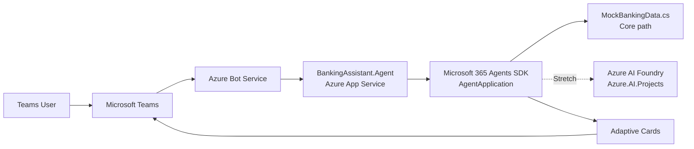

# Lab 04 - Microsoft 365 Agents SDK (.NET): Build a Teams Banking Agent

## Overview

In **Lab 02**, you built a low-code banking assistant in **Copilot Studio**.
In **Lab 03**, you rebuilt the same scenario as a pro-code assistant using
**Azure AI Foundry**. In **Lab 04**, you continue the modernization journey by
building a **Microsoft Teams agent** with the **Microsoft 365 Agents SDK for .NET 8**.

This lab has two paths:

- **Core path:** Build a Teams-hosted banking agent with welcome messaging,
  message routing, and Adaptive Cards backed by local mock banking data.
- **Stretch goal:** Connect the Teams agent to **Azure AI Foundry** so the agent
  can use model-driven intelligence instead of only local rule-based responses.

The result is a practical example of how to modernize a traditional bot-style
interaction into an agent hosted in Teams while keeping a clean .NET developer
experience.

**Lab owner/contact:** Brad.Lawrence@microsoft.com

---

## Learning Objectives

By the end of this lab, you will be able to:

- Create a .NET 8 Teams agent using the Microsoft 365 Agents SDK
- Understand the `AgentApplication` programming model
- Handle inbound Teams messages with `OnActivity(ActivityTypes.Message, ...)`
- Send a welcome message on `MembersAdded`
- Return structured responses using Adaptive Cards
- Configure Entra ID authentication for an agent hosted in Azure App Service
- Package and sideload a Teams app manifest
- Explain how Bot Framework patterns map to the M365 Agents SDK
- Extend the agent with Azure AI Foundry for richer reasoning

---

## Prerequisites

Before starting, confirm you have:

- **.NET 8 SDK** installed
- **Visual Studio 2022**, **VS Code**, or another C# editor
- Access to an **Azure subscription**
- Access to a **Microsoft Entra ID tenant** where you can create app registrations
- Permission to create an **Azure Bot** resource
- A **Microsoft Teams** test tenant or developer tenant
- **Dev Tunnels** installed for local HTTPS testing
- Familiarity with the banking assistant scenario from Labs 02 and 03

Helpful validation commands:

```powershell
dotnet --version
devtunnel --version
az account show
```

> If your environment is not ready, review `../../docs/environment-checklist.md`.

---

## Architecture



---

## Solution Structure

```text
lab04-agents-sdk/
|- README.md
|- .env.example
|- manifest/
|  |- manifest.json
|  |- color.png        # provide your own icon
|  '- outline.png      # provide your own icon
'- src/
   '- BankingAssistant.Agent/
      |- BankingAssistant.Agent.csproj
      |- Program.cs
      |- BankingAgent.cs
      |- appsettings.json
      |- Cards/
      |  '- AccountCard.cs
      '- Data/
         '- MockBankingData.cs
```

---

## Step 1: Create the .NET Project and Install Packages

Create the project:

```powershell
cd C:\projects\AIWorkshops\agent-modernization-workshops\labs\lab04-agents-sdk\src
dotnet new web -n BankingAssistant.Agent --framework net8.0
cd BankingAssistant.Agent
```

Install the core Microsoft 365 Agents SDK packages:

```powershell
dotnet add package Microsoft.Agents.Builder
dotnet add package Microsoft.Agents.Hosting.AspNetCore
dotnet add package Microsoft.Agents.Authentication.Msal
```

The finished lab already includes a starter implementation in this folder. If you
created a fresh project, replace the generated files with the versions included in
this lab.

### Why these packages?

- `Microsoft.Agents.Builder` - agent programming model and `AgentApplication`
- `Microsoft.Agents.Hosting.AspNetCore` - ASP.NET Core hosting and endpoint plumbing
- `Microsoft.Agents.Authentication.Msal` - Entra ID / MSAL-based authentication

---

## Step 2: Register an Entra ID App

Your Teams agent needs an Entra application identity.

1. Open the **Azure portal**.
2. Go to **Microsoft Entra ID** -> **App registrations** -> **New registration**.
3. Use these values:
   - **Name:** `BankingAssistantAgent`
   - **Supported account types:** Accounts in this organizational directory only
   - **Redirect URI:** leave blank for now
4. After creation, copy these values:
   - **Application (client) ID**
   - **Directory (tenant) ID**
5. Go to **Certificates & secrets** -> **New client secret** and copy the secret value.
6. Add any org-required API permissions for bot/Teams usage.

Save those values for `appsettings.json`, Azure App Service configuration, and the
Teams manifest.

> Tip: Use `.env.example` as a checklist for the values you need to capture.

---

## Step 3: Create an Azure Bot Resource

The Teams channel still connects through **Azure Bot Service**.

1. In the Azure portal, create an **Azure Bot** resource.
2. Use the **existing app registration** from Step 2.
3. After the resource is created, open **Configuration**.
4. Set the **Messaging endpoint** to:
   - Local dev: `https://<your-dev-tunnel-host>/api/messages`
   - Azure App Service: `https://<your-app-service-name>.azurewebsites.net/api/messages`
5. Open **Channels** and enable **Microsoft Teams**.

Keep the Azure Bot **Microsoft App ID** aligned with the Entra app registration and
the Teams manifest `botId`.

---

## Step 4: Implement the Agent

The heart of the lab is `BankingAgent.cs`. The class inherits from
`AgentApplication` and registers handlers in the constructor.

Core behaviors included in the sample:

- `OnActivity(ActivityTypes.Message, ...)` for inbound messages
- `OnConversationUpdate(ConversationUpdateEvents.MembersAdded, ...)` for welcome messages
- Local banking functions backed by `MockBankingData`
- Message parsing for balances, account lists, and transactions
- Adaptive Card responses for structured data
- A safe fallback response for unsupported prompts

Example handler pattern:

```csharp
OnConversationUpdate(ConversationUpdateEvents.MembersAdded, WelcomeMessageAsync);
OnActivity(ActivityTypes.Message, OnMessageAsync, rank: RouteRank.Last);
```

Open these files and review the implementation:

- `src/BankingAssistant.Agent/Program.cs`
- `src/BankingAssistant.Agent/BankingAgent.cs`
- `src/BankingAssistant.Agent/Data/MockBankingData.cs`

### Supported sample prompts

Try prompts like:

- `Show accounts for CUST-1001`
- `What is the checking balance for Alex Morgan?`
- `Show recent transactions for CUST-1002`
- `What savings accounts does Taylor Chen have?`

---

## Step 5: Add Adaptive Cards for Account Display

The helper in `Cards/AccountCard.cs` builds Adaptive Card payloads for account and
balance responses.

Why Adaptive Cards here?

- Better readability than plain text lists
- Native rendering in Teams
- Easy expansion later for buttons, actions, or account drill-down

The helper returns an attachment with content type:

```text
application/vnd.microsoft.card.adaptive
```

The core path uses cards for:

- account summary
- balance summary
- transaction summary

If you want to iterate visually, use the [Adaptive Cards Designer](https://adaptivecards.io/designer/).

---

## Step 6: Configure Auth (`appsettings.json`)

Update `src/BankingAssistant.Agent/appsettings.json` with your Entra values.

Values you must provide (under `Agents:Connections:BotServiceConnection:Settings`):

- `ClientId` - the Entra app (client) ID from Step 2
- `ClientSecret` - the client secret from Step 2
- `TenantId` - the directory (tenant) ID from Step 2

`AuthorityEndpoint` is pre-filled with the global Entra value
(`https://login.microsoftonline.com/`) and only needs changing for a sovereign cloud.

The sample config also includes optional placeholders for Azure AI Foundry used in
the stretch goal.

For local development you can either:

- edit `appsettings.json` directly for workshop use, or
- store secrets in environment variables / App Service settings for safer handling

Example PowerShell session variables:

```powershell
# Environment variables override appsettings.json. In ASP.NET Core, "__" (double
# underscore) maps to a nested config section, so these override the values under
# Agents:Connections:BotServiceConnection:Settings.
$env:Agents__Connections__BotServiceConnection__Settings__ClientId = "<client-id>"
$env:Agents__Connections__BotServiceConnection__Settings__ClientSecret = "<client-secret>"
$env:Agents__Connections__BotServiceConnection__Settings__TenantId = "<tenant-id>"
```

---

## Step 7: Test Locally with Dev Tunnels

Start a tunnel:

```powershell
devtunnel create --allow-anonymous
devtunnel port create -p 3978
devtunnel host
```

Run the agent locally:

```powershell
cd C:\projects\AIWorkshops\agent-modernization-workshops\labs\lab04-agents-sdk\src\BankingAssistant.Agent
dotnet run
```

> The project is preconfigured (via `Properties/launchSettings.json`) to listen on
> `http://localhost:3978`, matching the Dev Tunnel port above. Watch for the
> `Now listening on: http://localhost:3978` log line to confirm.

Then:

1. Copy the Dev Tunnel HTTPS URL.
2. Update the Azure Bot messaging endpoint to `https://<tunnel-host>/api/messages`.
3. Sideload the Teams app from Step 9.
4. Start a personal chat with the agent in Teams.

Expected behaviors:

- welcome message appears when the app is added
- balance/account prompts return Adaptive Cards
- unsupported prompts return the fallback help message

---

## Step 8: Deploy to Azure App Service

Publish the agent to App Service when local testing works.

Example CLI flow:

```powershell
az group create --name rg-banking-agent-lab --location eastus
az appservice plan create --name plan-banking-agent-lab --resource-group rg-banking-agent-lab --sku B1 --is-linux false
az webapp create --name <unique-app-name> --resource-group rg-banking-agent-lab --plan plan-banking-agent-lab --runtime "DOTNET|8.0"
```

Publish the app:

```powershell
dotnet publish -c Release
```

Set App Service application settings using the same configuration keys. In ASP.NET Core,
`__` (double underscore) maps to the nested `appsettings.json` section:

- `Agents__Connections__BotServiceConnection__Settings__ClientId`
- `Agents__Connections__BotServiceConnection__Settings__ClientSecret`
- `Agents__Connections__BotServiceConnection__Settings__TenantId`
- optional `AzureAI__ProjectEndpoint`
- optional `AzureAI__ModelDeployment`

Finally, update the Azure Bot messaging endpoint to:

```text
https://<your-app-service-name>.azurewebsites.net/api/messages
```

---

## Step 9: Create the Teams Manifest and Sideload

The lab includes `manifest/manifest.json` with placeholders.

Update at minimum:

- `id`
- `botId`
- `validDomains`
- `developer` URLs if your org requires real values

Package these files into a `.zip` for Teams sideloading:

- `manifest.json`
- `color.png`
- `outline.png`

> This lab intentionally **does not include** `color.png` and `outline.png`.
> Provide your own 192x192 color icon and 32x32 outline icon before sideloading.

Sideload process:

1. Open Teams.
2. Go to **Apps** -> **Manage your apps** -> **Upload a custom app**.
3. Upload the zipped manifest package.
4. Open the installed app in a personal chat.
5. Confirm the welcome message and banking prompts work.

---

## Step 10 (Stretch): Connect to Azure AI Foundry

The core path uses local functions and deterministic routing. For a more agentic
experience, connect the Teams agent to **Azure AI Foundry**.

### 10.1 Install stretch packages

```powershell
dotnet add package Azure.AI.Projects
dotnet add package Azure.Identity
```

### 10.2 Register the Foundry client in `Program.cs`

```csharp
using Azure.AI.Projects;
using Azure.Identity;

builder.Services.AddSingleton(sp =>
{
    var endpoint = builder.Configuration["AzureAI:ProjectEndpoint"];
    return new AIProjectClient(new Uri(endpoint!), new DefaultAzureCredential());
});
```

### 10.3 Replace local rule-based handling with a Foundry-backed service

One clean pattern is to introduce an interface such as:

```csharp
public interface IBankingAssistantService
{
    Task<string> GetReplyAsync(string userMessage, CancellationToken cancellationToken);
}
```

- **Core path implementation:** calls `MockBankingData`
- **Stretch implementation:** calls Azure AI Foundry using `AIProjectClient`

Example Foundry call shape:

```csharp
var chatClient = aiProjectClient.GetChatClient(configuration["AzureAI:ModelDeployment"]);
var response = await chatClient.CompleteAsync(
    [
        new ChatMessage(ChatRole.System, "You are a banking assistant for workshop demos."),
        new ChatMessage(ChatRole.User, userMessage)
    ],
    cancellationToken: cancellationToken);
```

### 10.4 Suggested modernization exercise

Refactor the agent so that:

- local mock functions remain available as domain tools or guardrails
- Azure AI Foundry handles natural language interpretation
- Adaptive Cards are still used for final Teams responses

This mirrors the transition from Lab 03's pro-code intelligence into a Teams-native
agent experience.

---

## Bot Framework Migration Comparison

| Bot Framework pattern | M365 Agents SDK pattern | Notes |
|---|---|---|
| `ActivityHandler` | `AgentApplication` | Primary class for routing activities |
| `OnMessageActivityAsync` | `OnActivity(ActivityTypes.Message, ...)` | Register message handlers explicitly |
| `OnMembersAddedAsync` | `OnConversationUpdate(ConversationUpdateEvents.MembersAdded, ...)` | Welcome flow pattern is similar |
| Adapter + controller plumbing | ASP.NET Core host registration in `Program.cs` | This lab uses a small `AddAgents`/`MapAgents` wrapper for readability |
| Bot App ID / password config | MSAL + Entra ID app registration | Identity story aligns to modern auth |
| Card attachments | Adaptive Card attachments | Same Teams rendering concept |
| Azure Bot channel config | Azure Bot channel config | Teams channel still routes through Azure Bot |
| Bot Framework code-first bot | Teams-hosted agent | Same channel goal, updated SDK model |

### Migration takeaways

- You still think in **activities**, but routing is more explicit.
- Teams remains a first-class channel, but the agent host model is simpler.
- Adaptive Cards remain a practical UI mechanism for structured business data.
- The modernization path can be incremental: keep local business functions first,
  then add Azure AI Foundry intelligence later.

---

## Deliverables

By the end of the lab, you should have:

- [ ] A .NET 8 Teams agent project using the Microsoft 365 Agents SDK
- [ ] Message handling implemented in `BankingAgent.cs`
- [ ] A welcome message for new conversations
- [ ] Adaptive Card responses for accounts, balances, or transactions
- [ ] Entra ID auth configured in `appsettings.json`
- [ ] An Azure Bot resource pointed at your endpoint
- [ ] A Teams manifest package ready for sideloading
- [ ] Optional: Azure AI Foundry connected for intelligent responses

---

## Troubleshooting

### The bot does not respond in Teams

Check:

- Azure Bot messaging endpoint is correct
- Dev Tunnel or App Service URL is reachable over HTTPS
- Teams channel is enabled in Azure Bot
- Your app registration IDs match across Azure Bot, config, and manifest

### I get 401 or 403 errors

Usually one of these is wrong:

- `ClientId`
- `ClientSecret`
- `TenantId`
- Azure Bot configured with a different app registration

### Adaptive Card does not render

Check:

- content type is `application/vnd.microsoft.card.adaptive`
- card JSON is valid
- card version is supported by Teams

### The Teams manifest upload fails

Check:

- `manifest.json` is valid JSON
- icon files exist in the zip package
- `botId` matches the Entra/Azure Bot app ID
- `validDomains` includes your Dev Tunnel or App Service hostname

### The stretch goal cannot connect to Foundry

Check:

- `AzureAI:ProjectEndpoint` is correct
- your signed-in identity or managed identity has access
- the deployment name in `AzureAI:ModelDeployment` exists

---

## References

- [Microsoft 365 Agents SDK for .NET GitHub repo](https://github.com/microsoft/Agents-for-net)
- [Microsoft 365 Agents SDK documentation](https://aka.ms/agents)
- [Adaptive Cards documentation](https://adaptivecards.io/)
- [Adaptive Cards Designer](https://adaptivecards.io/designer/)
- [Azure AI Foundry](https://ai.azure.com)
- [Dev Tunnels documentation](https://learn.microsoft.com/azure/developer/dev-tunnels/overview)
- [Bot Framework to M365 Agents SDK migration guidance](https://learn.microsoft.com/microsoft-365/agents-sdk/bf-migration-dotnet)

---

## Next Step

Continue to **Lab 05** to connect Teams and pro-code intelligence in a hybrid model:

-> [Lab 05 - Hybrid Agents](../lab05-hybrid-agent/)
