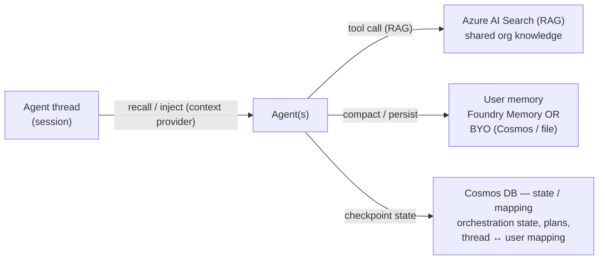

# Agent Memory — Design Guidance

**Author / contact:** Brad Lawrence · Brad.Lawrence@microsoft.com · Microsoft ISD
**Scope:** vendor-neutral design guidance for adding **memory** to multi-agent systems on Azure AI
Foundry with the Microsoft Agent Framework. Generic and reusable — no customer-specific content.
**Companion:** Lab 06 (`labs/lab06-multi-agent`) implements the **bring-your-own** tier of this
guidance as a runnable `--memory` demo.

> This document is assembled entirely from **public** Microsoft Learn / GitHub / Foundry-blog
> sources (see [References](#references)). It is safe to share.

---

## TL;DR

An agent that "remembers" is really **four different kinds of memory**, each with a different
lifetime and a different home. Don't force one store to do all four — that's how you get prompt
bloat, slow recall, and accidental data leakage.

| Tier | What it holds | Lifetime | Where it lives |
|---|---|---|---|
| **Conversation / working** | Active turn history, current task, tool-call trail, current plan | One session (a *thread*) | Managed agent **thread** |
| **User / customer memory** | Durable facts, preferences, decisions, pending actions | Across sessions | **Foundry-managed Memory** *or* a **bring-your-own** store (Cosmos DB / file) |
| **State / orchestration** | Workflow checkpoints, plans, thread↔user mappings | Across steps / restarts | **Azure Cosmos DB** |
| **Knowledge** | Shared, org-wide reference data (policies, catalogs, FAQs) | Long-lived, shared | **Azure AI Search** (RAG) |

**Two golden rules**

1. **Summaries + retrieval, not replay.** Don't stuff the entire chat history back into the prompt.
   Compact it to a small structured record and retrieve only what's relevant.
2. **Scope by user, separate from thread.** `userId` answers *whose* memory; `threadId` answers
   *which* conversation. Keep them distinct — one user has many threads over time.

---

## 1. Conversation / working memory — the thread

Use the framework's managed **thread / session** for everything that is only relevant *right now*:
active conversation history, the current task, tool-call results, and the working plan. The Agent
Framework's `AgentThread` / `AgentSession` abstraction preserves this and can be serialized to
survive a process restart.

**Do put in the thread:** active dialogue, current task context, tool-call history, current plan.
**Do *not* put in the thread:** user profile/preferences, long-lived business facts, org knowledge,
or anything you need to recall in a *future* session. Those belong in a durable tier below.

See: Agent Framework *Conversations & Memory* overview.

---

## 2. User / customer memory — the tier that matters most

This is the durable, cross-session memory of *a particular user*. There are **two legitimate ways**
to implement it. Teach and support both — pick per constraint.

### Option A — Foundry-managed Memory (platform does it)

Foundry Agent Service has a first-party **Memory** capability (preview). You provision a **memory
store**, attach it to the agent, and the platform automatically **extracts** salient facts from
conversations, **vectorizes** them, and **retrieves** them on later turns — including a user
profile and rolling conversation summaries. It's Cosmos-backed under the hood and supports
per-user scoping, retention/TTL, and explicit remember/forget.

- **Best when:** you want the least code and are happy to depend on the managed service; you have an
  **embedding** model deployed (recall is vector-based); preview is acceptable.
- **Trade-off:** newest surface (preview); you delegate extraction/retrieval policy to the platform.

### Option B — Bring-your-own store (you own it)

You keep a small memory record per user in **your** store and do a lightweight **compaction** step
yourself. In the Agent Framework this is a **context provider** (a `before_run` / `after_run` hook,
or `ChatClientAgentOptions` in .NET): read + inject on the way in, extract + persist on the way out.
The store can be a **file** (local/dev), **Azure Cosmos DB** (production), Redis, etc.

- **Best when:** you want portability, offline/unit-testable behavior, full control of *what* is kept
  and *how* it's summarized, or a **fallback** when managed memory isn't available in your resource.
- **Trade-off:** you own the compaction logic and the store lifecycle.

### Choosing

| If you need… | Pick |
|---|---|
| Least code, platform-owned extraction + vector recall | **Managed (A)** |
| Portability, offline tests, full control of what's kept | **BYO (B)** |
| A fallback that runs anywhere today | **BYO (B)** |
| Rich semantic recall over large memory sets | **Managed (A)** (or BYO + a vector store) |

> **Recommended posture:** start **BYO** (you can run and reason about it end-to-end, and it swaps
> file → Cosmos behind one interface), then adopt **managed** memory when you want the platform to own
> vectorization and retrieval. The two are not mutually exclusive.

---

## 3. State / orchestration memory — Cosmos DB

Multi-agent workflows need durable **state** that is not user memory and not conversation: plan
ledgers, checkpoints, retries, and the **mapping between threads and users**. Azure **Cosmos DB** is
the common home — low-latency, partition by `userId` (or `sessionId`), TTL for cleanup. This is also
the natural store for the **BYO** user-memory tier above, so one Cosmos account can host both with
separate containers (e.g. `chat-history`, `state`, `user-memory`).

---

## 4. Knowledge memory — Azure AI Search

Shared, organizational reference data (policies, product catalogs, FAQs) is **not** per-user memory —
it's **knowledge**, and it belongs in a retrieval index. Use **Azure AI Search** (RAG) as a tool the
agents call. It's shared across users, versioned independently, and updated without touching agents.

---

## 5. Compaction & recall — the read/write seams

Memory is best added as **two seams** around a run, independent of the agents themselves:

- **Recall (read, before the run):** load the user's memory record → build a short **preamble** →
  inject it into the agents' instructions/context. The team starts already knowing the user.
- **Compaction (write, after the run):** distill the run into a **small structured record** — not the
  raw transcript.

A durable, tool-agnostic compaction shape:

```jsonc
{
  "summary":         "one-paragraph rolling summary",
  "facts":           ["extracted, stable facts (amounts, terms, product)"],
  "decisions":       ["what was decided (offer, rate, action)"],
  "pending_actions": ["what's still open (dispute, escalation, follow-up)"],
  "recent_turns":    ["last N turns for continuity"]
}
```

**Start deterministic.** A rules-based compactor (regex/extraction, no LLM) is cheap, instant, and
predictable — ideal for demos and hot paths. Upgrade to **LLM summarization** later *without touching
the agents*, because compaction lives in the seam, not the agent.

**Why summaries beat replay:** replaying full history inflates tokens, cost, and latency, and buries
the signal. A compact record + targeted retrieval keeps prompts small and recall sharp.

---

## 6. Scoping, privacy & retention

- **Scope by user, separate from thread.** `userId` persists; `threadId` is per-run. Never key
  durable memory by thread.
- **Minimize what's durable.** Store **decisions and facts**, not a pile of PII or raw transcripts.
  Keep the least data that gives continuity.
- **Retention / TTL.** Set a default time-to-live so memory ages out; support explicit
  **remember/forget** for user control and compliance.
- **Make memory an explicit choice.** Defaulting memory **off** (opt-in) keeps stateless flows
  deterministic and auditable, and forces a conscious decision about what persists.

---

## 7. Reference architecture (generic)



- **Thread** = conversation/working memory (managed).
- **Context provider / seam** = recall on the way in, compaction on the way out.
- **User memory** = managed Foundry Memory *or* BYO Cosmos/file.
- **Cosmos** = orchestration state + thread↔user mapping.
- **AI Search** = shared knowledge (RAG), called as a tool.

---

## 8. How Lab 06 implements this

Lab 06 makes the **BYO user-memory tier** runnable and demoable:

- A `--memory <off|local|cosmos|foundry>` flag (default **off**) selects the backend behind one
  `IMemoryStore` interface (`Load` / `Save` / `Describe`).
- **`local`** (verified live) writes a JSON record per user under `.memory/` — no Azure needed.
- **Recall** builds a preamble from the record and injects it into every specialist's instructions
  (the same seam the lab's Skills use). **Compaction** is the deterministic shape above.
- **`cosmos`** (BYO managed store) and **`foundry`** (managed Memory) are wired to the same interface
  as the roadmap — a *store swap*, not a rewrite.

Scope keys: `customerId` = whose memory (persists) · `threadId` = which conversation (per-run).

---

## References

*All public.*

- **Foundry Agent Service — What is Memory?** https://learn.microsoft.com/en-us/azure/foundry/agents/concepts/what-is-memory
- **Foundry Agent Service — Create and use memory (how-to):** https://learn.microsoft.com/en-us/azure/foundry/agents/how-to/memory-usage
- **Foundry blog — Introducing Memory in Foundry Agent Service:** https://devblogs.microsoft.com/foundry/introducing-memory-in-foundry-agent-service/
- **Foundry blog — Making agent memory reliable & production-ready:** https://devblogs.microsoft.com/foundry/memory-build2026/
- **Foundry — Quickstart: give a hosted agent persistent memory:** https://github.com/MicrosoftDocs/azure-ai-docs/blob/main/articles/foundry/agents/quickstarts/quickstart-memory-hosted-agent.md
- **Agent Framework — Conversations & Memory overview:** https://learn.microsoft.com/en-us/agent-framework/concepts/agents/conversations/
- **Agent Framework — Adding context providers:** https://learn.microsoft.com/en-us/agent-framework/journey/adding-context-providers
- **Agent Framework — Chat History Memory Provider:** https://learn.microsoft.com/en-us/agent-framework/concepts/agents/conversations/chat-history-memory-provider
- **Agent Framework — Context provider integrations (Cosmos, Redis, AI Search, …):** https://learn.microsoft.com/en-us/agent-framework/integrations/by-component/context-providers/
- **Agent Framework — GitHub:** https://github.com/microsoft/agent-framework
- **Azure Cosmos DB — overview:** https://learn.microsoft.com/en-us/azure/cosmos-db/introduction
- **Azure AI Search — Retrieval-Augmented Generation (RAG) overview:** https://learn.microsoft.com/en-us/azure/search/retrieval-augmented-generation-overview
