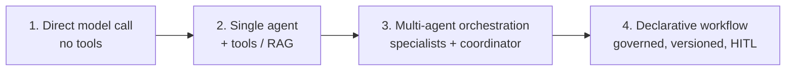
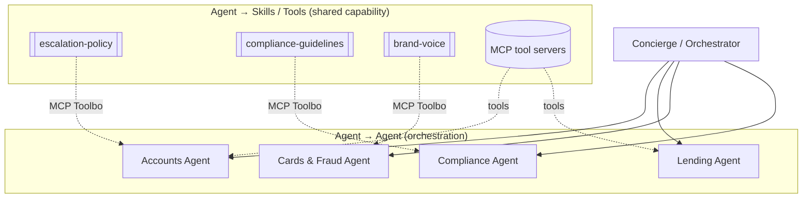
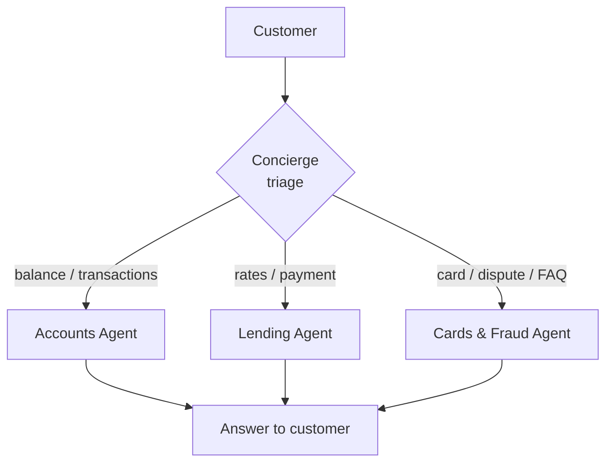
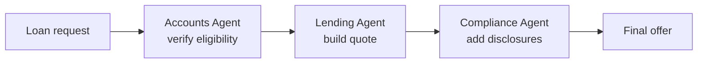
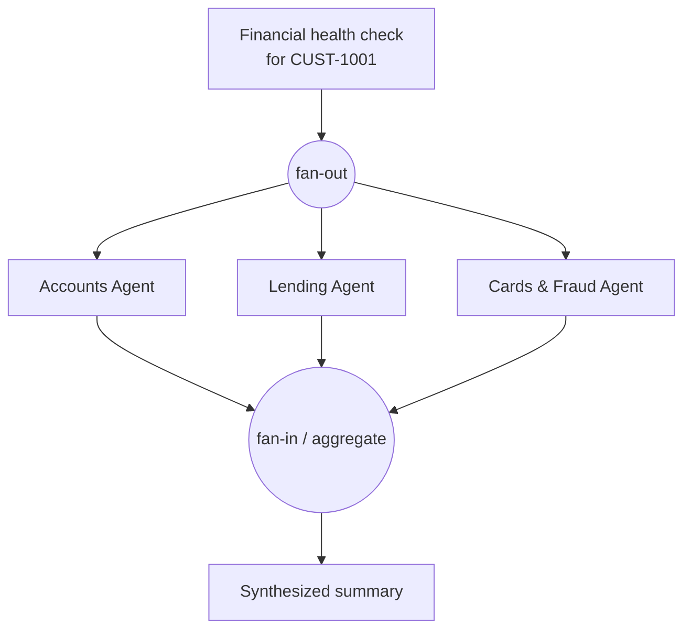
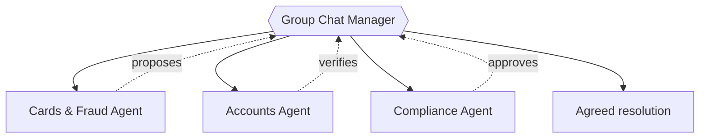
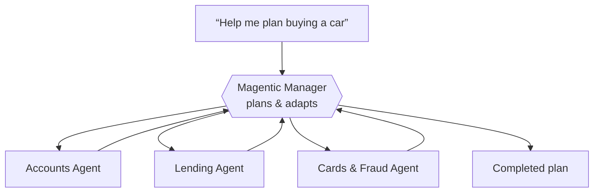
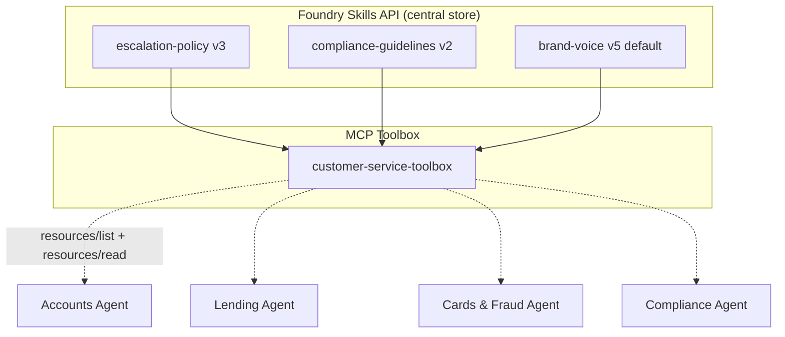
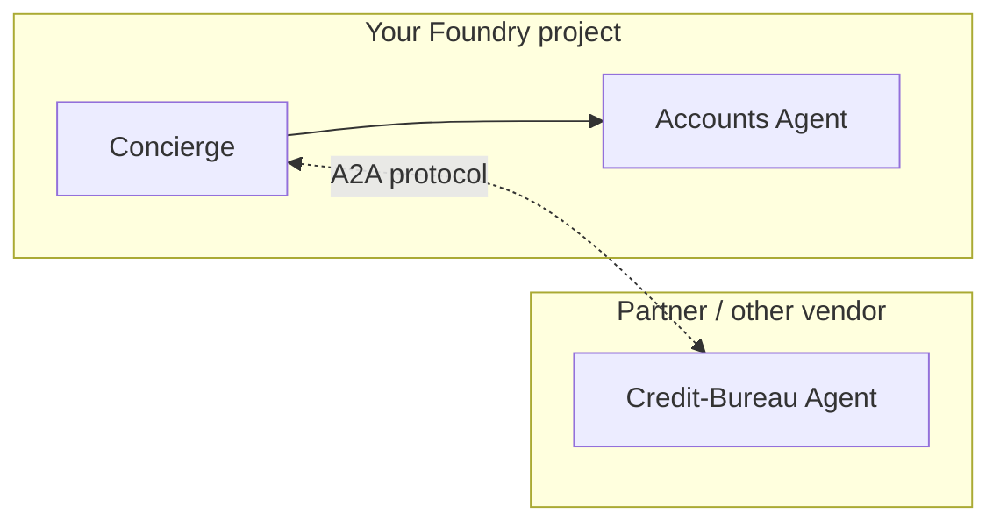
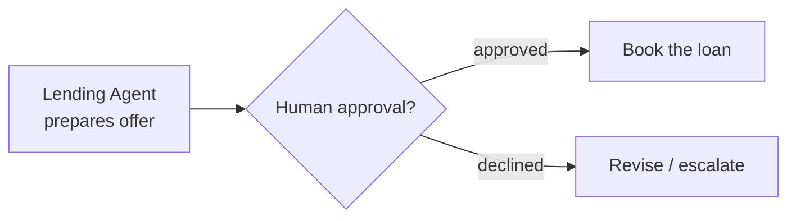

# Lab 06 – Multi-Agent Orchestration

## Overview

Build a **Retail Banking Concierge** — a multi-agent system where an orchestrator
coordinates a team of specialist agents to answer questions and complete tasks that
no single agent owns end-to-end. This lab demonstrates the **current** (2026)
orchestration patterns on Azure AI Foundry across **two dimensions**:

| Dimension | What it means | This lab shows |
|---|---|---|
| **Agent → Agent** | Agents delegate to, collaborate with, or hand off to other agents | The **5 canonical orchestration patterns** via **Microsoft Agent Framework** |
| **Agent → Skills / Tools** | Agents pull in shared behavior (Skills) and capabilities (MCP tools/servers) at runtime | **MCP Toolbox + `SKILL.md`** and **MCP servers** as tools |

The lab reuses the **same banking domain** from Lab 03 (customers `CUST-1001…1003`,
their accounts, transactions, loan rates, and FAQ) so you can focus on *orchestration*
rather than re-learning the tools. Both a **Python** path (`src/`) and a **.NET** path
(`src-dotnet/`) are provided, mirroring Lab 03.

> **Contact:** Brad.Lawrence@microsoft.com

---

## What "current" means (read this first)

Multi-agent orchestration on Foundry moved fast. Several older mechanisms are now on a
**retirement clock**, and the go-forward standard is the **Microsoft Agent Framework**
(the GA SDK that merged Semantic Kernel + AutoGen). This lab teaches the go-forward path
and clearly flags what is being retired so your teams don't build on sand.

### ⏳ Deprecation & Retirement Timeline

> ⚠️ **Verify these dates before you present.** They are accurate as of **August 2026**
> from the primary Microsoft sources linked below, but Microsoft occasionally revises
> retirement schedules. Treat this table as "known retirements to plan around," not a
> guarantee.

| Component / API | Status | Retirement date | Recommended replacement |
|---|---|---|---|
| Azure OpenAI **Assistants API** | Deprecated | **Aug 26, 2026** | Foundry Agent Service (**Responses API**) |
| Foundry **Multi-Agent Workflows** (visual + YAML designer) | Public preview, retiring | **Dec 1, 2026** | **Microsoft Agent Framework** |
| Foundry Agent Service **classic** (incl. **Connected Agents**) | Deprecated | **Mar 31, 2027** | Foundry Agent Service (current) + **Agent Framework** |
| **Prompt Flow** | Deprecated | **Apr 20, 2027** | Foundry **evaluations** + Agent Framework |

**What this means for orchestration design:**
- ✅ **Build new multi-agent logic on Microsoft Agent Framework** (Python or .NET).
- ⚠️ **Foundry Workflows** (the low-code visual designer in Part C) is great for
  business-owned, declarative orchestration **today**, but it retires **Dec 1, 2026** —
  use it to prototype, plan to migrate to Agent Framework.
- ⚠️ The classic **"Connected Agents"** feature (one agent calling other agents as tools
  inside Agent Service *classic*) retires **Mar 31, 2027**. Re-platform onto Agent
  Framework orchestration.

> **Sources:**
> [Foundry Agent Service *classic* retirement (Q&A)](https://learn.microsoft.com/en-us/answers/questions/5934023/will-azure-ai-agents-sdk-foundry-agent-service-cla) ·
> [Workflows retirement notice](https://learn.microsoft.com/en-us/azure/foundry/agents/concepts/workflow) ·
> [Assistants API deprecation](https://learn.microsoft.com/en-us/azure/ai-services/openai/how-to/assistant) ·
> [Migration guide](https://learn.microsoft.com/en-us/azure/foundry/agents/how-to/migrate)

---

## Learning Objectives

By the end of this lab you will be able to:

- Decide **when** to use multi-agent orchestration (the complexity ladder) vs. a single agent
- Name and apply the **5 canonical orchestration patterns**: Sequential, Concurrent,
  Group Chat, Handoff, and Magentic
- Build **Foundry-backed specialist agents** and orchestrate them with the **Microsoft
  Agent Framework** (Python and .NET)
- Wire **agent → skills** via an **MCP Toolbox** (`SKILL.md`) and **agent → tools** via
  **MCP servers**
- Prototype **declarative orchestration** with **Foundry Multi-Agent Workflows**
  (visual + YAML) — and know its retirement timeline
- Enable **cross-vendor** agent collaboration with the **A2A (Agent-to-Agent) protocol**
- Add **shared memory**, **human-in-the-loop** approvals, and **end-to-end observability**
  across the agent graph

---

## Prerequisites

| Requirement | Details |
|---|---|
| Lab 03 complete | You have a Foundry project + deployed model (e.g. `gpt-4o`) and the banking tools working |
| Azure AI Foundry | Project endpoint + a chat model deployment |
| Python 3.10–3.12 **or** .NET 8+ | Match whichever path you completed in Lab 03. Use Python **3.10–3.12** for the Python path — 3.13/3.14 may not yet have prebuilt wheels for every dependency. The .NET path targets **net8.0**. |
| Azure CLI | `az login` (Agent Framework uses `AzureCliCredential` / `DefaultAzureCredential`) |
| Multiple agents | This lab creates **4–5 specialist agents**. They can be lightweight (same model, different instructions/tools) |

> ⚠️ **This lab has the largest Azure footprint in the series.** You will create several
> agents and (optionally) shared state stores. See the
> [environment checklist](../../docs/environment-checklist.md) sections **A2** (Azure
> subscription + Foundry) and **A4** (shared state: Cosmos DB / AI Search / Blob).
> To keep costs low, all specialists can share **one** model deployment.

> 🧭 **SDK currency callout.** The Microsoft Agent Framework is evolving quickly. The
> class names, import paths, and builder signatures in this lab reflect the API as
> **documented in August 2026** (sources are linked at each step). **Always verify
> against the version you install** — `pip show agent-framework` (Python) or the package
> version in your `.csproj` (.NET) — and the current
> [Agent Framework docs](https://learn.microsoft.com/en-us/agent-framework/).

---

## Concepts

### The orchestration complexity ladder

Multi-agent is powerful but not free — every added agent adds latency, cost, and failure
surface. **Use the lowest rung that reliably meets the requirement:**



> **Rule of thumb:** reach for multi-agent when a task spans **distinct domains of
> expertise**, needs **parallelism**, or benefits from **separation of concerns**
> (independent prompts, tools, and guardrails per specialist). If one well-prompted agent
> with a handful of tools does the job, stay on rung 2.
>
> **Source:** [AI agent orchestration patterns — Azure Architecture Center](https://learn.microsoft.com/en-us/azure/architecture/ai-ml/guide/ai-agent-design-patterns)

### The 5 canonical orchestration patterns

These are the exact five patterns named by the Azure Architecture Center, implemented by
the Microsoft Agent Framework, and (partially) offered as Foundry Workflow templates.

| Pattern | Topology | Coordinator decides… | Banking example in this lab |
|---|---|---|---|
| **Sequential** | Fixed pipeline A→B→C | nothing — order is fixed | Loan application: **Accounts** (verify) → **Lending** (quote) → **Compliance** (disclose) |
| **Concurrent** | Fan-out / fan-in (parallel) | nothing — all run, then aggregate | **Financial health check**: Accounts + Lending + Cards run in parallel, then synthesize |
| **Group Chat** | Manager-moderated round-table | who speaks next | **Dispute resolution**: Cards & Fraud + Accounts + Compliance debate to a resolution |
| **Handoff** | Triage → specialist | which specialist owns the request | **Concierge** routes to Accounts / Lending / Cards *(the flagship demo)* |
| **Magentic** | Planner-driven, adaptive | the whole plan, and re-plans on stalls | Open-ended **"help me plan a big purchase"** across all specialists |

> The 5th pattern is **Magentic** (from the Magentic-One research), not "magnetic."

### Agent → Agent vs. Agent → Skills/Tools

Orchestration isn't only agents talking to agents. A well-designed system layers two
things:



- **Agent → Agent** = the orchestration patterns above (who does the work).
- **Agent → Skills** = shared, versioned *behavior* (`SKILL.md`) delivered via an **MCP
  Toolbox**, so a policy change updates every agent with no redeploy (Part B).
- **Agent → Tools** = shared *capabilities* (functions, remote **MCP servers**) the
  agents call to act (Part B).

---

## Lab Contents

```
lab06-multi-agent/
├── README.md                         # This file — full walkthrough
├── data/                             # Copied from Lab 03 (self-contained)
│   ├── customers.json  accounts.json  transactions.json  banking-faq.txt
├── src/                              # Python path (Microsoft Agent Framework)
│   ├── banking_agents.py             # Specialist agent factory + shared tools
│   ├── skill_library.py              # Loads SKILL.md files at runtime (Agent → Skills)
│   ├── orchestrate_handoff.py        # Flagship: Concierge → specialists (Handoff)
│   ├── patterns/
│   │   ├── sequential_loan.py        # Sequential pipeline
│   │   ├── concurrent_healthcheck.py # Concurrent fan-out/fan-in
│   │   ├── group_chat_dispute.py     # Group Chat round-table
│   │   └── magentic_planner.py       # Magentic adaptive plan
│   ├── requirements.txt
│   └── .env.example
├── src-dotnet/                       # .NET path (Microsoft.Agents.AI.Workflows)
│   ├── BankingConcierge.slnx
│   ├── .env.example
│   └── BankingConcierge/             # Console host: agent factory, tools, pattern switch
│       ├── Program.cs                #   --pattern handoff|sequential|concurrent|groupchat|magentic  --skills on|off
│       ├── AgentTeam.cs              #   specialist factory (.AsAIAgent) — composes Skills into instructions
│       ├── Skills/SkillLibrary.cs    #   loads SKILL.md files at runtime (Agent → Skills)
│       ├── Data/  Models/  Tools/    #   banking domain (from Lab 03)
│       └── BankingConcierge.csproj
├── skills/                           # Agent → Skills (SKILL.md files, loaded at runtime)
│   ├── escalation-policy/SKILL.md
│   ├── compliance-guidelines/SKILL.md
│   └── brand-voice/SKILL.md
└── workflows/
    └── loan-application.workflow.yaml # Declarative Foundry Workflow (Part C)
```

---

## Meet the specialist team

Every pattern in this lab draws from the same four specialists (plus the coordinator).
Each is a Foundry-backed agent with a focused system prompt and a **subset** of the Lab 03
banking tools — this separation of concerns is the whole point.

| Agent | Owns | Tools (from Lab 03) |
|---|---|---|
| **Accounts Agent** | Balances, transactions, account lists, profile | `get_account_balance`, `get_recent_transactions`, `list_accounts`, `get_customer_profile` |
| **Lending Agent** | Loan rates and payment math | `get_loan_rates`, `calculate_loan_payment` |
| **Cards & Fraud Agent** | Card questions, disputes, general FAQ | `search_faq` (+ demo card/fraud stubs) |
| **Compliance Agent** | Disclosures, policy checks, PII handling | *(no data tools — loads the `compliance-guidelines` Skill at runtime)* |
| **Concierge** | Triage + delegation + synthesis | *(no data tools — orchestrates specialists)* |

---

## Run it (quickstart)

Both paths read the same `data/` and accept your Lab 03 credentials. Sign in first with
`az login`, then pick a path:

**Python**
```bash
cd src
python -m venv .venv && .venv\Scripts\activate      # PowerShell: .venv\Scripts\Activate.ps1
pip install -r requirements.txt
copy .env.example .env                               # then edit FOUNDRY_PROJECT_ENDPOINT / FOUNDRY_MODEL
python orchestrate_handoff.py                        # flagship interactive handoff
python patterns/sequential_loan.py                   # or any pattern under patterns/
```

**.NET**
```bash
cd src-dotnet
copy .env.example .env                               # then edit FOUNDRY_PROJECT_ENDPOINT / FOUNDRY_MODEL
dotnet run --project BankingConcierge -- --pattern handoff       # default; interactive
dotnet run --project BankingConcierge -- --pattern sequential    # accounts → lending → compliance
dotnet run --project BankingConcierge -- --pattern concurrent    # parallel health check
dotnet run --project BankingConcierge -- --pattern groupchat     # round-robin dispute table
dotnet run --project BankingConcierge -- --pattern magentic       # adaptive planner (plans, delegates, re-plans)
dotnet run --project BankingConcierge -- --pattern handoff --customer CUST-1002
dotnet run --project BankingConcierge -- --pattern sequential --skills off   # Agent → Skills OFF (base instructions only)
```

> 🧩 **Skills are ON by default** — the specialists load the versioned `SKILL.md` files at
> runtime. Add `--skills off` (.NET) or set `USE_SKILLS=off` (Python) to run the same team
> without them, then edit a `SKILL.md` and re-run to change behavior with no code change. See
> **Part B1**.

> 💡 The .NET project targets **net8.0**. If your machine only has a newer .NET runtime
> installed, set `DOTNET_ROLL_FORWARD=LatestMajor` before `dotnet run`. Windows consoles:
> `chcp 65001` (or the app sets UTF-8 automatically) keeps the ✓/↳ glyphs readable. All
> five patterns are implemented in **both** paths; the .NET path was validated end-to-end
> against a live Foundry `gpt-4o` deployment, and the Python path uses the same
> source-verified Agent Framework API.

---

# Part A — Agent → Agent Orchestration (Microsoft Agent Framework)

The Microsoft Agent Framework provides one **orchestration builder per pattern**. You
compose agents into a `Workflow` and `run` it. The same specialist agents can be dropped
into any pattern — only the builder changes.

> **Install (Python):** `pip install -r src/requirements.txt` — pulls `agent-framework`
> plus the Foundry client (`agent-framework-foundry`) and orchestration builders
> (`agent-framework-orchestrations`). **Install (.NET):** the `src-dotnet` project already
> references `Microsoft.Agents.AI`, `Microsoft.Agents.AI.Workflows`,
> `Microsoft.Agents.AI.Foundry`, and `Azure.AI.Projects` (see versions in
> [`BankingConcierge.csproj`](src-dotnet/BankingConcierge/BankingConcierge.csproj)).

### A0. Create Foundry-backed specialist agents

**Python** — one client, many agents (all share a model deployment):

```python
import os
from agent_framework import Agent
from agent_framework.foundry import FoundryChatClient
from azure.identity import AzureCliCredential

client = FoundryChatClient(
    project_endpoint=os.environ["FOUNDRY_PROJECT_ENDPOINT"],   # your Foundry V2 project endpoint
    model=os.environ["FOUNDRY_MODEL"],                          # e.g. "gpt-4o"
    credential=AzureCliCredential(),                            # run `az login` first
)

# One client, many agents — each is just an Agent bound to that client with a
# focused prompt and a subset of tools. Plain callables become tools automatically.
accounts_agent = Agent(
    client=client,
    name="AccountsAgent",
    instructions=("You handle balances, transactions, account lists, and profile "
                  "lookups. Never reveal another customer's data."),
    tools=[get_account_balance, get_recent_transactions, list_accounts, get_customer_profile],
)
lending_agent = Agent(
    client=client,
    name="LendingAgent",
    instructions="You handle loan rates and payment calculations. Quote APRs as-of the data.",
    tools=[get_loan_rates, calculate_loan_payment],
)
cards_agent = Agent(
    client=client,
    name="CardsFraudAgent",
    instructions="You handle card questions, disputes, and general banking FAQ.",
    tools=[search_faq],
)
```

> ℹ️ **Verified API.** `FoundryChatClient` (from `agent_framework.foundry`) and
> `Agent(client=..., ...)` are confirmed against the Agent Framework orchestration
> samples (github.com/microsoft/agent-framework, `python/samples/03-workflows/`) as of
> Aug 2026. Env names `FOUNDRY_PROJECT_ENDPOINT` / `FOUNDRY_MODEL` match those samples;
> the lab's `banking_agents.get_client()` also accepts the Lab 03 names. If your version
> defaults tools to require approval, wrap each callable with
> `tool(approval_mode="never_require")` from `agent_framework`.

**.NET** — `AIProjectClient` from Lab 03, extended to produce `AIAgent`s:

```csharp
using Azure.AI.Projects;
using Azure.Identity;
using Microsoft.Agents.AI;

var project = new AIProjectClient(
    new Uri(Environment.GetEnvironmentVariable("FOUNDRY_PROJECT_ENDPOINT")!),
    new DefaultAzureCredential());

string model = Environment.GetEnvironmentVariable("FOUNDRY_MODEL")!;

// .AsAIAgent(...) is an extension on AIProjectClient (Microsoft.Agents.AI.Foundry).
ChatClientAgent accountsAgent = project.AsAIAgent(model,
    name: "AccountsAgent",
    description: "Balances, transactions, account lists, and profile lookups.",
    instructions: "You handle balances, transactions, account lists, and profile lookups.");

ChatClientAgent lendingAgent = project.AsAIAgent(model,
    name: "LendingAgent",
    description: "Loan rates and payment calculations.",
    instructions: "You handle loan rates and payment calculations.");

ChatClientAgent cardsAgent = project.AsAIAgent(model,
    name: "CardsFraudAgent",
    description: "Card questions, disputes, and general banking FAQ.",
    instructions: "You handle card questions, disputes, and general banking FAQ.");
```

> **Source:** [Agent Framework — Foundry-backed agents](https://learn.microsoft.com/en-us/agent-framework/) ·
> `.AsAIAgent(...)` is an extension on `AIProjectClient` from `Microsoft.Agents.AI.Foundry`.

---

### A1. Pattern: **Handoff** — Concierge → specialist *(flagship)*

The coordinator (a **triage** agent) inspects the request and **hands off** the whole
conversation to exactly one specialist. This is the pattern the original lab skeleton
described as "router → specialist."



**Python:**

```python
from agent_framework import AgentResponse
from agent_framework.orchestrations import HandoffBuilder, HandoffAgentUserRequest

concierge = Agent(
    client=client,
    name="Concierge",
    instructions=("You are the triage concierge for a retail bank. Read the customer's "
                  "request and hand off to the right specialist. Do not answer domain "
                  "questions yourself."),
)

workflow = (
    HandoffBuilder(
        name="banking-concierge",
        participants=[concierge, accounts_agent, lending_agent, cards_agent],
    )
    .with_start_agent(concierge)
    .build()
)

# Handoff is interactive: the workflow streams events and pauses on `request_info`
# to collect the next customer turn. Drive it with a request/response loop.
async for event in workflow.run("What's my available balance on ACCT-4521?", stream=True):
    if event.type == "output":                      # AgentResponse from a specialist
        for msg in event.data.messages:
            print(msg.text)
    elif event.type == "handoff_sent":              # who handed off to whom
        print(f"[handoff] {event.data.source} -> {event.data.target}")
# On a `request_info` event carrying a HandoffAgentUserRequest, reply with:
#   await workflow.run(responses={req.request_id: HandoffAgentUserRequest.create_response(text)})
# See src/orchestrate_handoff.py for the full loop.
```

**.NET:**

```csharp
using Microsoft.Agents.AI.Workflows;

ChatClientAgent concierge = project.AsAIAgent(model, name: "Concierge",
    description: "Triage agent that routes to specialists.",
    instructions: "Triage the request and hand off to the right specialist.");

AIAgent[] specialists = [accountsAgent, lendingAgent, cardsAgent];

// Handoffs are directional. Allow triage -> each specialist, and each specialist -> triage
// so control can return for a follow-up on a different topic.
Workflow workflow = AgentWorkflowBuilder
    .CreateHandoffBuilderWith(concierge)
    .WithHandoffs(concierge, specialists)
    .WithHandoffs(specialists, concierge)
    .Build();
```

> Run any of these workflows with the in-process runtime:
> ```csharp
> List<ChatMessage> messages = [new(ChatRole.User, "What's my balance on ACCT-4521?")];
> await using StreamingRun run = await InProcessExecution.RunStreamingAsync(workflow, messages);
> await run.TrySendMessageAsync(new TurnToken(emitEvents: true));
> await foreach (WorkflowEvent evt in run.WatchStreamAsync())
> {
>     if (evt is AgentResponseUpdateEvent u) Console.Write(u.Update.Text);
>     else if (evt is WorkflowOutputEvent output) { /* output.As<List<ChatMessage>>() */ }
> }
> ```

> **Source:** [Handoff orchestration](https://learn.microsoft.com/en-us/agent-framework/workflows/orchestrations/handoff)
> · Full runnable version: [`src/orchestrate_handoff.py`](src/orchestrate_handoff.py) /
> [`src-dotnet/BankingConcierge`](src-dotnet/) (`dotnet run -- --pattern handoff`).

---

### A2. Pattern: **Sequential** — loan application pipeline

A fixed pipeline where each agent's output feeds the next. Perfect for **process flows**
with a required order and hand-off of intermediate state.



**Python:**

```python
from typing import cast
from agent_framework import AgentResponse
from agent_framework.orchestrations import SequentialBuilder

workflow = SequentialBuilder(
    participants=[accounts_agent, lending_agent, compliance_agent],
    output_from="all",          # collect every stage's contribution
).build()

# Sequential returns when the pipeline finishes; read the collected outputs.
result = await workflow.run(
    "CUST-1001 wants a $25,000 auto loan for 60 months. Prepare an offer.",
)
for output in result.get_outputs():
    for msg in cast(AgentResponse, output).messages:
        print(f"[{msg.author_name}] {msg.text}")
```

**.NET:**

```csharp
Workflow workflow = AgentWorkflowBuilder.BuildSequential(
    accountsAgent, lendingAgent, complianceAgent);
```

> **Source:** [Sequential orchestration](https://learn.microsoft.com/en-us/agent-framework/workflows/orchestrations/sequential)

---

### A3. Pattern: **Concurrent** — financial health check

Fan the request out to several specialists **in parallel**, then aggregate their answers.
Cuts latency when sub-tasks are independent.



**Python:**

```python
from typing import cast
from agent_framework import AgentResponse
from agent_framework.orchestrations import ConcurrentBuilder

workflow = ConcurrentBuilder(
    participants=[accounts_agent, lending_agent, cards_agent],
).build()

# Concurrent fans out, then fans in; get_outputs() returns each branch's response.
events = await workflow.run(
    "Give CUST-1001 a financial health check: balances, loan options, and any card alerts.",
)
for output in events.get_outputs():
    for msg in cast(AgentResponse, output).messages:
        print(f"[{msg.author_name}] {msg.text}")
```

**.NET:**

```csharp
Workflow workflow = AgentWorkflowBuilder.BuildConcurrent(
    new[] { accountsAgent, lendingAgent, cardsAgent });
```

> **Source:** [Concurrent orchestration](https://learn.microsoft.com/en-us/agent-framework/workflows/orchestrations/concurrent)

---

### A4. Pattern: **Group Chat** — dispute resolution round-table

A **manager** decides who speaks next as specialists collaborate toward a resolution.
Use when the answer needs **negotiation / debate** across domains.



**Python:**

```python
from agent_framework import AgentResponseUpdate
from agent_framework.orchestrations import GroupChatBuilder, GroupChatState

def pick_next(state: GroupChatState) -> str:
    # Simple round-robin selector; swap in your own routing logic.
    names = list(state.participants.keys())
    return names[state.current_round % len(names)]

workflow = GroupChatBuilder(
    participants=[cards_agent, accounts_agent, compliance_agent],
    selection_func=pick_next,
    termination_condition=lambda conv: len(conv) >= 6,
    intermediate_output_from=[cards_agent, accounts_agent, compliance_agent],
).build()

# Group chat streams as the specialists debate; watch intermediate + final turns.
async for event in workflow.run(
    "CUST-1003 disputes a $180 charge on their debit card ending 3378. Resolve it.",
    stream=True,
):
    if event.type in ("intermediate", "output") and isinstance(event.data, AgentResponseUpdate):
        print(f"[{event.data.author_name}] {event.data.text}")
```

**.NET:**

```csharp
Workflow workflow = AgentWorkflowBuilder
    .CreateGroupChatBuilderWith(agents =>
        new RoundRobinGroupChatManager(agents) { MaximumIterationCount = 6 })
    .AddParticipants([cardsAgent, accountsAgent, complianceAgent])
    .Build();
```

> **Source:** [Group chat orchestration](https://learn.microsoft.com/en-us/agent-framework/workflows/orchestrations/group-chat)

---

### A5. Pattern: **Magentic** — open-ended purchase planner

A **Magentic manager** builds a plan, delegates tasks to specialists, tracks progress in
a ledger, and **re-plans when it stalls**. Use for **open-ended goals** where the steps
aren't known up front.



**Python:**

```python
from agent_framework import AgentResponseUpdate
from agent_framework.orchestrations import MagenticBuilder

workflow = MagenticBuilder(
    participants=[accounts_agent, lending_agent, cards_agent],
    manager_agent=concierge,     # plans, delegates, and re-plans on stalls
    intermediate_output_from=[accounts_agent, lending_agent, cards_agent],
    max_round_count=10,
    max_stall_count=3,
    max_reset_count=2,
).build()

async for event in workflow.run(
    "CUST-1001 wants to buy a $30k car. Figure out affordability and next steps.",
    stream=True,
):
    if event.type in ("intermediate", "output") and isinstance(event.data, AgentResponseUpdate):
        print(f"[{event.data.author_name}] {event.data.text}")
```

**.NET** *(the Magentic types live in `Microsoft.Agents.AI.Workflows.Specialized.Magentic`):*

```csharp
using Microsoft.Agents.AI.Workflows;
using Microsoft.Agents.AI.Workflows.Specialized.Magentic;

Workflow workflow = new MagenticWorkflowBuilder(concierge)   // concierge acts as the manager
    .AddParticipants([accountsAgent, lendingAgent, cardsAgent])
    .WithName("PurchasePlanner")
    .WithDescription("Plans an affordability analysis across the banking specialists.")
    .RequirePlanSignoff(false)      // set true to gate on a human plan review (Part F)
    .WithMaxRounds(10)
    .WithMaxStalls(3)
    .WithMaxResets(2)
    .Build();
```

> Streamed events add Magentic-specific types — `MagenticPlanCreatedEvent`,
> `MagenticReplannedEvent`, and `MagenticProgressLedgerUpdatedEvent` — so you can print
> the evolving plan and progress ledger (see `src-dotnet/BankingConcierge/Program.cs`).

> **Source:** [Magentic orchestration](https://learn.microsoft.com/en-us/agent-framework/workflows/orchestrations/magentic)

---

# Part B — Agent → Skills & Agent → Tools

Orchestration also means giving your specialists **shared behavior** and **shared
capabilities** without duplicating them in every prompt.

### B1. Agent → Skills via MCP Toolbox

**Skills** are versioned `SKILL.md` files (Markdown + YAML front matter) stored centrally
in Foundry and surfaced to agents through an **MCP Toolbox**. Change the policy once,
every agent picks it up — **no redeploy**. This lab ships three:

| Skill | Why a skill (not a prompt) |
|---|---|
| [`escalation-policy`](skills/escalation-policy/SKILL.md) | Ops updates escalation rules without touching agent code |
| [`compliance-guidelines`](skills/compliance-guidelines/SKILL.md) | One source of truth across **every** specialist; audit trail |
| [`brand-voice`](skills/brand-voice/SKILL.md) | Marketing updates tone quarterly; no dev cycle |

**This lab ships a runnable rendering.** Both paths load these `SKILL.md` files at runtime and
compose the mapped rules into each specialist's instructions — so you can demonstrate the value
prop today without the preview Skills API. Toggle it to see the difference:

```bash
# .NET — skills ON (default) vs OFF
dotnet run --project BankingConcierge -- --pattern sequential                # Skills: ON
dotnet run --project BankingConcierge -- --pattern sequential --skills off   # Skills: OFF

# Python — same toggle via env (default ON)
python patterns/sequential_loan.py                     # Skills: ON
set USE_SKILLS=off&& python patterns/sequential_loan.py   # Skills: OFF  (bash: USE_SKILLS=off python …)
```

With skills **on**, the Compliance agent enforces the exact rules from
`compliance-guidelines/SKILL.md` (last-4 only, APR + as-of date, "estimates — *not a commitment
to lend*", no tax/legal advice). Edit the `SKILL.md`, re-run, and every mapped agent changes
behavior — **no code change**. The skill→agent mapping lives in
[`SkillLibrary`](src-dotnet/BankingConcierge/Skills/SkillLibrary.cs) /
[`skill_library.py`](src/skill_library.py) (`compliance-guidelines` is shared by **all**).

The **production path** stores these centrally in Foundry and surfaces them through an **MCP
Toolbox** so any MCP client (your specialists, GitHub Copilot, Claude, custom agents) discovers
them via `resources/list` → `resources/read`:



Attach skills to a toolbox so any MCP client (your specialists, GitHub Copilot, Claude,
custom agents) discovers them via `resources/list` → `resources/read`:

```python
from azure.ai.projects import AIProjectClient
project = AIProjectClient(endpoint=endpoint, credential=credential)

project.beta.skills.create_version(
    name="compliance-guidelines",
    content=open("skills/compliance-guidelines/SKILL.md").read(),
    description="Regulatory language + PII handling rules for all agents",
)

project.beta.toolboxes.create_version(
    name="customer-service-toolbox",
    description="Shared tools + skills for banking specialists",
    tools=[...],                       # function tools
    skills=["escalation-policy", "compliance-guidelines", "brand-voice"],
)
```

> The exact Python reference type for a skill entry (e.g. `ToolboxSkillReference`) varies
> by SDK version — **verify against your installed `azure-ai-projects`**. The portal and
> REST API are the version-stable way to attach skills.
>
> **Deep dive:** [docs/ai-foundry-review.md §4 — Foundry Skills & Toolboxes](../../docs/ai-foundry-review.md) ·
> **Source:** [Use skills with Foundry agents (preview)](https://learn.microsoft.com/en-us/azure/foundry/agents/how-to/tools/skills)

### B2. Agent → Tools via MCP servers

Beyond local function tools, agents can call **remote MCP servers** (a fraud-scoring
service, a core-banking API, Azure DevOps, etc.). MCP tool support in Foundry Agent
Service is **GA**.

```python
from azure.ai.agents.models import McpTool

fraud_mcp = McpTool(
    server_label="fraud_scoring",
    server_url="https://your-fraud-mcp.example.com",
    allowed_tools=["score_transaction", "flag_card"],   # optional allowlist
)
# attach to an agent definition via tools=[fraud_mcp]
```

**MCP server auth options:** key-based · Microsoft Entra (agent managed identity) ·
OAuth On-Behalf-Of passthrough · unauthenticated.

> **Source:** [Model Context Protocol tool (Foundry Agent Service)](https://learn.microsoft.com/en-us/azure/foundry/agents/how-to/tools/model-context-protocol)

---

# Part C — Declarative Orchestration: Foundry Multi-Agent Workflows

For **business-owned, low-code** orchestration, Foundry offers **Multi-Agent Workflows**:
a visual designer *and* a YAML definition, with variables, JSON-schema-typed hand-offs,
Power Fx expressions, immutable versioning, and built-in tracing.

> 🛑 **Retiring Dec 1, 2026.** Microsoft's guidance: *"If you're looking to build new
> workflows, use Microsoft Agent Framework."* Use Workflows to **prototype** and to give
> non-developers a visual model — but plan the migration path to Part A.
> **Source:** [Workflows concept + retirement notice](https://learn.microsoft.com/en-us/azure/foundry/agents/concepts/workflow)

**Built-in templates:** Sequential · Group chat · **Human-in-the-loop**. *(Concurrent and
Handoff exist only in the Agent Framework SDK, not the visual designer.)*

**Where to build it:**
1. Foundry portal → **Build** → **Create new workflow** → pick a template → drag agents onto the canvas.
2. Toggle the **YAML** view to edit as code (round-trips with the visual designer).
3. Or use **VS Code** with the **Microsoft Foundry Toolkit** extension.
4. **Run Workflow** in the portal chat pane, or invoke via the Agent Service API.

A minimal declarative workflow ([`workflows/loan-application.workflow.yaml`](workflows/loan-application.workflow.yaml)):

```yaml
kind: workflow
metadata:
  name: loan-application
  description: Verify the customer, build a quote, and add disclosures.

trigger:
  kind: OnConversationStart
  id: start
  actions:
    - kind: SetVariable
      id: capture_request
      variable: Local.Request
      value: =System.LastMessageText

steps:
  - kind: InvokeAzureAgent
    id: verify
    agent: AccountsAgent
    input: ${Local.Request}
    output: Local.Eligibility

  - kind: InvokeAzureAgent
    id: quote
    agent: LendingAgent
    input: ${Local.Eligibility}
    output: Local.Quote

  - kind: InvokeAzureAgent
    id: disclose
    agent: ComplianceAgent
    input: ${Local.Quote}
    output: Local.FinalOffer
```

> Confirmed top-level keys: `kind`, `metadata`, `trigger`, `steps`. Variables use
> `Local.*` / `System.*` (Power Fx). **Source:**
> [Workflow YAML reference](https://learn.microsoft.com/en-us/azure/foundry/agents/concepts/azure-yaml-reference).

---

# Part D — Cross-Platform: A2A (Agent-to-Agent) Protocol

Everything above is **inside** one Foundry project. To collaborate with agents built by
**other teams, vendors, or clouds**, use the **A2A protocol** — an open standard (v1.0,
ratified April 2026, Linux Foundation) for secure agent-to-agent calls over HTTP.



- **Status in Foundry:** **Public preview** (prompt + hosted agents, since June 2026).
- **Expose** a Foundry agent as an A2A endpoint (REST / Python SDK), or **call** an
  external A2A agent as a tool (`agent-to-agent` tool type).
- **Auth:** Microsoft **Entra Agent ID** authentication is GA; broader cross-org
  *discovery* registry is still preview.

> Use **A2A** for cross-vendor interop; use **Agent Framework** (Part A) for orchestration
> *within* your project. **Sources:**
> [Enable an A2A endpoint](https://learn.microsoft.com/en-us/azure/foundry/agents/how-to/enable-agent-to-agent-endpoint) ·
> [A2A tool](https://learn.microsoft.com/en-us/azure/foundry/agents/how-to/tools/agent-to-agent)

---

# Part E — Shared Memory & State

Specialists that never share context feel disjointed. Give the team a shared memory so a
handoff doesn't lose what the customer already said.

| Strategy | Store | Best for |
|---|---|---|
| **Conversation memory** | Cosmos DB (or in-memory for the lab) | Full turn history across handoffs |
| **Knowledge memory** | Shared **AI Search** index | Facts/documents all agents ground on |
| **Session state** | Blob / key-value | Small structured state (selected customer, cart) |

Agent Framework threads conversation state through the `Workflow` automatically; for
**cross-session** persistence, back it with Cosmos DB or Foundry's built-in **Memory**
tool. Test that context (e.g., the selected customer `CUST-1001`) survives a handoff.

---

# Part F — Human-in-the-Loop & Approvals

Some actions shouldn't be fully autonomous (e.g., approving a loan, closing an account).
Treat human approval as a **first-class orchestration step**:

- **Foundry Workflows:** the **Human-in-the-loop** template pauses and asks the user,
  then resumes with their input.
- **Agent Framework:** insert an approval gate before a high-impact tool call — the
  workflow surfaces a request and waits for a signed-off response before continuing.



**Rule:** any tool that **moves money, changes entitlements, or is irreversible** goes
behind an approval gate.

---

# Part G — Observability across the agent graph

A single-agent trace isn't enough when five agents collaborate. You need to see the
**whole graph**: which agent ran, why the coordinator chose it, each tool call, tokens,
latency, and where it stalled.

- Enable **Foundry tracing** (OpenTelemetry) so every agent + tool call is captured.
- Send traces to **Application Insights**; use the **Agents (preview)** view to follow a
  request across specialists.
- Add **evaluations** (groundedness, task success, tool-selection accuracy) per specialist
  *and* end-to-end.

> 🔗 This is the bridge to **[Lab 07 – Testing & Observability](../lab07-eval-observability/)**,
> which goes deep on tracing, evaluation, and monitoring. Build the orchestration here;
> instrument and evaluate it there.

---

## "Is anything missing?" — orchestration coverage checklist

Use this to confirm a multi-agent demo shows the *current* surface, not just one pattern:

- [x] **All 5 patterns** (Sequential, Concurrent, Group Chat, Handoff, Magentic) — not just router/handoff
- [x] **Microsoft Agent Framework** as the go-forward SDK (Python + .NET)
- [x] **Agent → Skills** — versioned `SKILL.md` **loaded at runtime** (runnable `--skills on|off` toggle) + the production **MCP Toolbox** path
- [x] **Agent → Tools** via remote **MCP servers**
- [x] **Declarative Workflows** (visual + YAML) — with the **Dec 1, 2026 retirement** caveat
- [x] **A2A protocol** for cross-vendor / cross-cloud agents (preview)
- [x] **Human-in-the-loop** approval gates
- [x] **Shared memory / state** across handoffs
- [x] **Observability + evaluation** across the whole agent graph (→ Lab 07)
- [x] **Currency & migration** notes (Connected Agents / Assistants API / Prompt Flow retirements)

---

## Deliverables

- [ ] Four specialist agents (Accounts, Lending, Cards & Fraud, Compliance) + a Concierge
- [ ] The **Handoff** flagship running end-to-end (Python and/or .NET)
- [ ] At least **two more patterns** demonstrated (e.g., Sequential + Concurrent)
- [ ] Shared **Skills** attached via an MCP Toolbox
- [ ] A declarative **Workflow** YAML (Part C) — with the retirement caveat understood
- [ ] Shared memory verified across a handoff
- [ ] One **human-in-the-loop** approval gate
- [ ] Traces visible across the agent graph (hand-off to Lab 07)
- [ ] Architecture diagram documented

---

## Sources

- [AI agent orchestration patterns — Azure Architecture Center](https://learn.microsoft.com/en-us/azure/architecture/ai-ml/guide/ai-agent-design-patterns)
- [Microsoft Agent Framework](https://learn.microsoft.com/en-us/agent-framework/) · [GitHub](https://github.com/microsoft/agent-framework)
- [Foundry Multi-Agent Workflows (concept + retirement)](https://learn.microsoft.com/en-us/azure/foundry/agents/concepts/workflow)
- [Foundry Agent Service overview](https://learn.microsoft.com/en-us/azure/foundry/agents/overview)
- [MCP tool for agents](https://learn.microsoft.com/en-us/azure/foundry/agents/how-to/tools/model-context-protocol) · [Skills (preview)](https://learn.microsoft.com/en-us/azure/foundry/agents/how-to/tools/skills)
- [A2A endpoint](https://learn.microsoft.com/en-us/azure/foundry/agents/how-to/enable-agent-to-agent-endpoint) · [A2A tool](https://learn.microsoft.com/en-us/azure/foundry/agents/how-to/tools/agent-to-agent)
- [Migration guide (classic → current)](https://learn.microsoft.com/en-us/azure/foundry/agents/how-to/migrate)
- Internal deep dive: [docs/ai-foundry-review.md](../../docs/ai-foundry-review.md) §4 (Skills) and §6 (Agent Service)

---

## Next Steps

→ [Lab 07: Testing & Observability](../lab07-eval-observability/) — Evaluate and monitor
the multi-agent system you just built.
