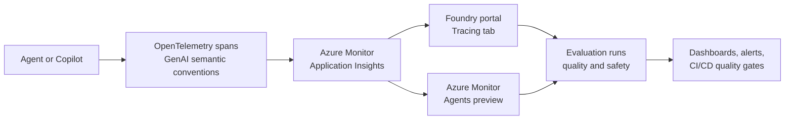

# Lab 07 – Testing, Evaluation, and Observability

## Overview

Implement quality gates, evaluation pipelines, and enterprise monitoring for agents
built in previous labs. Ensure agents are production-ready with measurable quality.

## Learning Objectives

- Define quality metrics for conversational agents
- Build evaluation pipelines using Foundry evaluators or custom scripts
- Enable Copilot Studio analytics
- Configure Application Insights dashboards for agent observability

## Prerequisites

- Agents from Labs 02–06 deployed and accessible
- Application Insights / Log Analytics workspace enabled
- Access to conversation logs (non-PII or redacted)

> ⚠️ See [environment checklist](../../docs/environment-checklist.md) section A4.

## Lab Steps

### Step 1: Define Quality Metrics

Establish metrics for your agents:

| Metric | Description | Target |
|---|---|---|
| **Groundedness** | Are responses grounded in provided knowledge? | > 90% |
| **Relevance** | Do responses answer the user's question? | > 85% |
| **Coherence** | Are responses well-structured and clear? | > 90% |
| **Fluency** | Is the language natural and grammatical? | > 95% |
| **Safety** | Are responses free of harmful content? | 100% |
| **Completion rate** | Do users achieve their goal? | > 80% |

### Step 2: Build an Evaluation Dataset

1. Collect or create test conversations (10–20 examples minimum)
2. Include:
   - User messages (inputs)
   - Expected responses or acceptable response criteria
   - Context / knowledge sources used
3. Save as a structured dataset (JSON or CSV)

### Step 3: Run Evaluations

#### Option A: Azure AI Foundry Evaluators

1. Use built-in evaluators (groundedness, relevance, coherence)
2. Configure the evaluation pipeline
3. Run against your test dataset
4. Review evaluation scores

#### Option B: Custom Evaluation Pipeline

1. Create a script that sends test inputs to your agent
2. Compare agent responses against expected outcomes
3. Score using LLM-as-judge or rule-based criteria
4. Generate a summary report

### Step 4: Copilot Studio Analytics

1. Open Copilot Studio → **Analytics**
2. Review:
   - Session completion rates
   - Topic triggering accuracy
   - Escalation rates
   - User satisfaction scores
3. Identify topics that need improvement

### Step 5: Application Insights Observability

1. Open Application Insights for your deployed agents
2. Explore:
   - Request traces and latency
   - Tool-calling success/failure rates
   - Token usage and model performance
   - Error rates and exceptions
3. Create a dashboard with key agent health metrics
4. Set up alerts for critical failures

## Foundry Observability Best Practices

Agent observability combines **tracing**, **evaluation**, and **monitoring**.
Traditional APM shows latency, exceptions, and dependencies, but agents also
introduce non-deterministic responses, multi-step tool calls, token cost,
prompt/context changes, and quality drift. Treat observability as a feedback
loop: trace what happened, evaluate whether it was good, and monitor trends.
See the [Microsoft Foundry observability overview](https://learn.microsoft.com/en-us/azure/ai-foundry/concepts/observability)
for the lifecycle model.



### Three Pillars for Agents

| Pillar | What to capture | Why it matters |
|---|---|---|
| **Tracing** | Agent runs, model calls, tool invocations, retrieval steps, span attributes | Explains why an answer changed, which tool failed, and where latency or cost was introduced |
| **Evaluation** | Groundedness, relevance, coherence, fluency, similarity, safety, task and tool quality | Measures response quality and safety, not just uptime |
| **Monitoring** | Latency, tokens, cost, errors, throttling, quality scores, traffic volume | Detects production regressions, drift, and operational incidents |

### Tracing with OpenTelemetry GenAI Semantic Conventions

Microsoft Foundry tracing stores traces in Application Insights and surfaces
them in the Foundry portal **Tracing** tab. The trace data uses OpenTelemetry
Generative AI semantic conventions (`gen_ai.*` attributes) for model calls,
tool invocations, and agent steps. Azure Monitor's Agents experience also uses
these semantics for cross-framework views. See the Foundry
[trace application guide](https://learn.microsoft.com/en-us/azure/ai-foundry/how-to/develop/trace-application),
Azure Monitor [Agents view](https://learn.microsoft.com/en-us/azure/azure-monitor/app/agents-view),
and [OpenTelemetry GenAI semantic conventions](https://opentelemetry.io/docs/specs/semconv/gen-ai/).

1. Link an Application Insights resource to the Foundry project.
2. Enable telemetry for the agent/application where the SDK supports it
   (for example, `enable_telemetry=True` or the equivalent project setting).
3. Configure Azure Monitor OpenTelemetry export using the project's
   Application Insights connection string.
4. Run the agent, then open Foundry → **Tracing** to inspect the end-to-end run.

```bash
pip install azure-ai-projects azure-monitor-opentelemetry \
    opentelemetry-instrumentation-openai-v2
```

```python
import os
from azure.ai.projects import AIProjectClient
from azure.identity import DefaultAzureCredential
from azure.monitor.opentelemetry import configure_azure_monitor
from opentelemetry.instrumentation.openai_v2 import OpenAIInstrumentor

project_client = AIProjectClient(
    credential=DefaultAzureCredential(),
    endpoint=os.environ["AZURE_AI_PROJECT"],
)

connection_string = (
    project_client.telemetry.get_application_insights_connection_string()
)

configure_azure_monitor(connection_string=connection_string)
OpenAIInstrumentor().instrument()

# Calls made through the project client now emit OpenTelemetry spans.
client = project_client.get_openai_client()
response = client.chat.completions.create(
    model=os.environ["MODEL_DEPLOYMENT_NAME"],
    messages=[{"role": "user", "content": "Summarize the account policy."}],
)
```

> ⚠️ Content capture is a privacy decision. Keep message content capture off by
> default for production unless approved. For development, the OpenTelemetry
> instrumentation supports `OTEL_INSTRUMENTATION_GENAI_CAPTURE_MESSAGE_CONTENT`
> and Foundry `trace-content` settings. Use environment-specific configuration
> and redact or avoid PII in prompts, retrieved context, traces, and logs.

Add your own spans around orchestration logic so the trace tells the full story:

```python
from opentelemetry import trace

tracer = trace.get_tracer(__name__)

@tracer.start_as_current_span("route-customer-request")
def route_customer_request(intent: str, tool_name: str):
    span = trace.get_current_span()
    span.set_attribute("agent.intent", intent)
    span.set_attribute("agent.tool.selected", tool_name)
    # Call retrieval, tools, and model here.
```

### Continuous and Online Evaluation

Do not limit evaluation to the offline dataset from Step 2. Use the Azure AI
Evaluation SDK (`azure-ai-evaluation`) to run quality and safety evaluators
against both curated test cases and sampled production traffic. Foundry supports
built-in evaluators for groundedness, relevance, coherence, fluency,
similarity, and risk/safety checks such as hate/unfairness, violence, sexual,
self-harm, protected material, and indirect attacks. Agent evaluation also adds
agent-specific checks such as intent resolution, tool call accuracy, and task
adherence; some agent evaluation capabilities are preview. See the
[Evaluation SDK guide](https://learn.microsoft.com/en-us/azure/ai-foundry/how-to/develop/evaluate-sdk)
and [agent evaluation guide](https://learn.microsoft.com/en-us/azure/ai-foundry/how-to/develop/agent-evaluate-sdk).

```bash
pip install azure-ai-evaluation
```

```python
import os

from azure.ai.evaluation import (
    CoherenceEvaluator,
    FluencyEvaluator,
    GroundednessEvaluator,
    RelevanceEvaluator,
    SimilarityEvaluator,
)

model_config = {
    "azure_endpoint": os.environ["AZURE_OPENAI_ENDPOINT"],
    "azure_deployment": os.environ["EVALUATOR_MODEL_DEPLOYMENT"],
    "api_version": os.environ.get("AZURE_OPENAI_API_VERSION", "2024-12-01-preview"),
}

evaluators = {
    "groundedness": GroundednessEvaluator(model_config),
    "relevance": RelevanceEvaluator(model_config),
    "coherence": CoherenceEvaluator(model_config),
    "fluency": FluencyEvaluator(model_config),
    "similarity": SimilarityEvaluator(model_config),
}

row = {
    "query": "What documents are needed to open an account?",
    "response": agent_response,
    "context": retrieved_context,
    "ground_truth": expected_answer,
}

scores = {name: evaluator(**row) for name, evaluator in evaluators.items()}
```

Recommended workshop pattern:

1. **Pull request gate**: run a small deterministic dataset in CI/CD and fail
   the build if key scores drop below the targets from Step 1.
2. **Nightly regression**: run the full evaluation dataset plus recent failure
   examples and compare with the previous baseline.
3. **Online sampling**: sample a low percentage of redacted production traffic,
   evaluate asynchronously, and send scores back to Application Insights as
   custom metrics or span attributes.
4. **Human review queue**: route low-scoring or safety-flagged conversations to
   a review process before adding them to the regression set.

### Unified Agent Observability in Azure Monitor

Application Insights includes an **Agents (Preview)** experience that provides
a unified view of agent telemetry from Microsoft Foundry, Copilot Studio, and
third-party frameworks that emit OpenTelemetry GenAI semantics. Use it to:

- Inspect end-to-end agent runs, model calls, tool calls, and failures.
- Sort traces by token usage to find expensive interactions.
- Filter traces with GenAI errors to debug failed or low-quality runs.
- Correlate trace IDs with evaluation scores and safety findings.
- Open Foundry or Azure Monitor from the same investigation path.

When possible, write the evaluation run ID, evaluator names, and scores back to
the active trace or to a custom event keyed by `operation_Id`. This keeps
"what happened" and "was it good" together during incident review.

### Operational Dashboards and Alerts

Create an Application Insights workbook or dashboard with at least these tiles:

| Signal | Example threshold |
|---|---|
| P50/P95 latency by model, agent, and tool | Alert when P95 is 2x baseline for 15 minutes |
| Token usage and estimated cost | Alert on daily spend spikes or unusual model mix |
| Tool-call success/failure rate | Alert on critical tool failure rate > 5% |
| Error and exception rate | Alert on new exception types or error rate > 2% |
| Throttling / 429s | Alert on sustained 429s or retry exhaustion |
| Quality and safety scores | Alert when groundedness, relevance, or safety drops below target |

Example KQL starter queries for a workbook:

```kusto
// GenAI traces with token counts and duration
traces
| where timestamp > ago(24h)
| extend model = tostring(customDimensions["gen_ai.request.model"])
| extend inputTokens = todouble(customDimensions["gen_ai.usage.input_tokens"])
| extend outputTokens = todouble(customDimensions["gen_ai.usage.output_tokens"])
| summarize totalTokens=sum(inputTokens + outputTokens),
            traceCount=count()
    by model, bin(timestamp, 1h)
| order by timestamp desc
```

```kusto
// Failed requests, exceptions, and throttling
requests
| where timestamp > ago(24h)
| summarize requests=count(), failures=countif(success == false),
            p95Duration=percentile(duration, 95)
    by cloud_RoleName, resultCode, bin(timestamp, 15m)
| where failures > 0 or resultCode == "429"
```

> ⚠️ Schema details vary by SDK, exporter, and sampling configuration. If a
> `gen_ai.*` attribute is not in `customDimensions`, inspect a recent trace in
> Application Insights and adjust the workbook query to match your telemetry.

### AI Red Teaming as an Observability Signal

Add adversarial testing to the same quality loop. The Azure AI Foundry AI Red
Teaming Agent (preview) is built on PyRIT and can run automated scans against a
model endpoint or application callback for risks such as violence,
hate/unfairness, sexual content, self-harm, protected material, code
vulnerability, and ungrounded attributes. Use it before production releases and
on a schedule for high-risk changes. See the
[AI Red Teaming Agent guide](https://learn.microsoft.com/en-us/azure/ai-foundry/how-to/develop/run-scans-ai-red-teaming-agent).

```bash
pip install "azure-ai-evaluation[redteam]"
```

```python
import os

from azure.ai.evaluation.red_team import RedTeam, RiskCategory
from azure.identity import DefaultAzureCredential

red_team_agent = RedTeam(
    azure_ai_project=os.environ["AZURE_AI_PROJECT"],
    credential=DefaultAzureCredential(),
    risk_categories=[
        RiskCategory.Violence,
        RiskCategory.HateUnfairness,
        RiskCategory.Sexual,
        RiskCategory.SelfHarm,
    ],
    num_objectives=5,
)

async def target_callback(query: str) -> str:
    return call_agent(query)

red_team_result = await red_team_agent.scan(target=target_callback)
```

Capture scan results as release evidence and create work items for failures.
Because red teaming and some agent evaluation features are preview, confirm
region support and production suitability before using them in a live system.

### Data Governance Checklist

- Use mock or redacted data in workshop traces and evaluation datasets.
- Disable prompt/response content capture in production unless there is an
  approved data handling requirement.
- Redact account numbers, names, addresses, access tokens, and other PII before
  logs or traces leave the application boundary.
- Separate development and production telemetry settings with environment
  variables, not code changes.
- Restrict Application Insights and Log Analytics access with least privilege.
- Document sampling rates, retention settings, and who can view trace content.

## Deliverables

- [ ] Quality metrics defined with targets
- [ ] Evaluation dataset created (10+ test cases)
- [ ] Evaluation pipeline run with results documented
- [ ] Copilot Studio analytics reviewed (if applicable)
- [ ] Application Insights dashboard created
- [ ] Foundry tracing enabled and verified in the Tracing tab
- [ ] Continuous evaluation plan documented, including CI/CD quality gates
- [ ] Agent observability workbook or dashboard includes latency, cost, errors,
  tool calls, and quality scores
- [ ] Data governance settings documented for trace content capture and PII redaction
- [ ] AI red teaming scan or plan documented for safety regression testing
- [ ] Key findings and improvement recommendations documented

## Next Steps

→ [Lab 08: Capstone](../lab08-capstone/) — Team presentations and architecture review

## References

- [Trace AI applications in Microsoft Foundry](https://learn.microsoft.com/en-us/azure/ai-foundry/how-to/develop/trace-application)
- [Observability in Generative AI - Microsoft Foundry](https://learn.microsoft.com/en-us/azure/ai-foundry/concepts/observability)
- [Local evaluation with the Azure AI Evaluation SDK](https://learn.microsoft.com/en-us/azure/ai-foundry/how-to/develop/evaluate-sdk)
- [Agent evaluation with the Microsoft Foundry SDK](https://learn.microsoft.com/en-us/azure/ai-foundry/how-to/develop/agent-evaluate-sdk)
- [Monitor AI agents with Application Insights](https://learn.microsoft.com/en-us/azure/azure-monitor/app/agents-view)
- [Run AI Red Teaming Agent locally](https://learn.microsoft.com/en-us/azure/ai-foundry/how-to/develop/run-scans-ai-red-teaming-agent)
- [OpenTelemetry GenAI semantic conventions](https://opentelemetry.io/docs/specs/semconv/gen-ai/)
