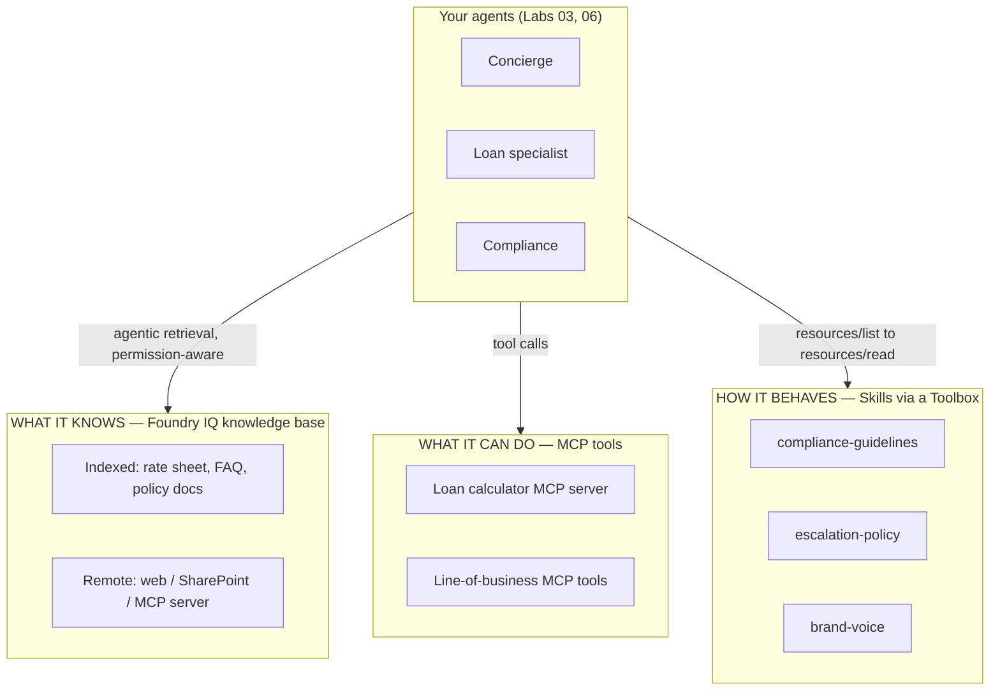
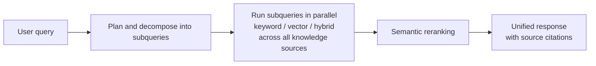
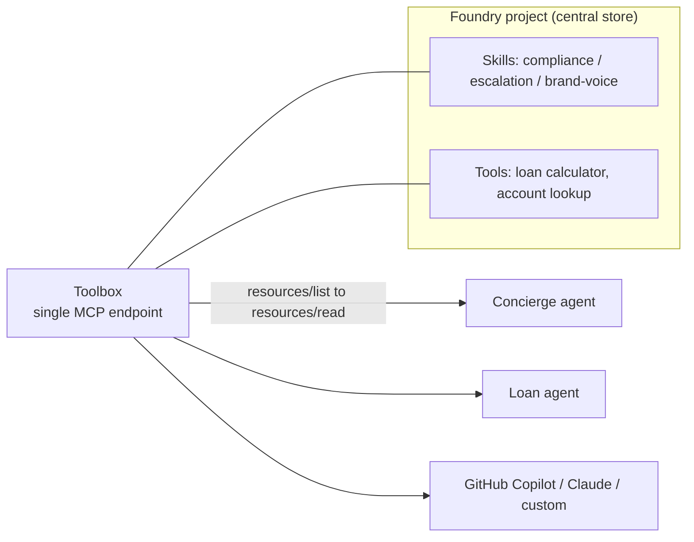

# Lab 08 – Managing Knowledge, Tools & Skills

## Overview

Every production agent has to answer three questions well:

| Question | The layer that answers it | This lab |
|---|---|---|
| **What does the agent *know*?** | **Knowledge sources** — grounding in your enterprise content | **Foundry IQ** knowledge bases (the main focus) |
| **What can the agent *do*?** | **Tools** — capabilities it can call at runtime | **MCP** tools and servers |
| **How does it *behave consistently*?** | **Skills** — versioned, shared behavior | **Skills + Toolboxes** |

Labs 03–07 built agents and orchestrated them. This lab is about the **knowledge and
extensibility layer underneath** — how to turn scattered enterprise content into
**reusable, permission-aware knowledge** with **Foundry IQ**, how to attach and govern
**MCP tools**, and how to share behavior across agents with **Skills** and **Toolboxes**.

The lab reuses the **same banking domain** as Labs 03 and 06 (customers `CUST-1001…1003`,
their accounts and transactions, the **loan rate sheet**, **product FAQ**, and **policy
documents**) so you focus on *managing knowledge and tools*, not re-learning the domain.

> **Contact:** Brad.Lawrence@microsoft.com

> This lab is **portal- and concept-forward** (like Lab 07). It walks the Microsoft
> Foundry portal, then shows grounded, copy-adaptable snippets and links the
> end-to-end runnable samples. Foundry IQ / agentic retrieval is evolving quickly —
> **verify API versions and preview status before you present** (see the callout below).

---

## Preview & versioning — read this first

Foundry IQ is built on **Azure AI Search agentic retrieval**. Capability availability
depends on the **Search Service REST API version** you call:

| Path | Status | Notes |
|---|---|---|
| **`2026-04-01` REST API** (programmatic) | **Generally available** | Minimal, extractive retrieval over generally available knowledge sources |
| **`2026-08-01-preview` REST API** (programmatic) | **Preview** | Preview knowledge sources (Azure SQL, File, SharePoint, Fabric, MCP server, Work IQ) and using an LLM with non-web sources |
| **Azure portal / Microsoft Foundry portal** | **Preview** | The portals expose **all** agentic retrieval features as preview |

> ⚠️ **Accurate as of this writing.** Preview features carry no SLA and aren't for
> production. Confirm the current GA/preview split in
> [Migrate agentic retrieval code to the latest version](https://learn.microsoft.com/en-us/azure/search/agentic-retrieval-how-to-migrate)
> before you build or demo.

---

## Where this fits in the series

| Lab | What it did with knowledge & tools |
|---|---|
| [Lab 03 – Foundry Agent](../lab03-foundry-agent/) | Grounded one agent on a **single AI Search index** + function tools |
| [Lab 06 – Multi-Agent](../lab06-multi-agent/) | Used **Skills** and **MCP** as *supporting actors* for orchestration |
| **Lab 08 (this lab)** | Makes the **knowledge & tools layer the subject** — multi-source **Foundry IQ** knowledge bases, **governed MCP tools**, and **shared Skills/Toolboxes** as reusable, permission-aware assets |
| [Lab 09 – Capstone](../lab09-capstone/) | Teams present architectures that use these building blocks |

The throughline: **Lab 03 grounded *one* agent on *one* index.** Real programs have many
agents and many content sources. Foundry IQ lets you define the knowledge **once** and
reuse it across every agent, with permissions enforced at query time.

---

## Learning Objectives

By the end of this lab you will be able to:

- Explain what **Foundry IQ** is and how a **knowledge base**, **knowledge sources**, and
  **agentic retrieval** fit together on top of Azure AI Search
- Choose between **indexed** and **remote** knowledge sources and know the 12 supported kinds
- Build a **multi-source, permission-aware knowledge base** (portal and programmatic) and
  **connect it to an agent** — and to **Copilot Studio**
- Tune retrieval with the **reasoning effort** setting and understand its cost/latency tradeoff
- Enforce **document-level security** (ACLs, Microsoft Purview sensitivity labels, caller
  Entra identity) and reason about **data-boundary** implications for remote sources
- Attach and **govern MCP tools** (connections, auth, approvals, allow-listing, monitoring)
- Manage **Skills** and **Toolboxes** as versioned, shared behavior across many agents

---

## Prerequisites

| Requirement | Details |
|---|---|
| Lab 03 complete | A Microsoft Foundry project + a deployed chat model, and the banking content (rate sheet, FAQ) available |
| Azure AI Search | A search service in a [region that supports agentic retrieval](https://learn.microsoft.com/en-us/azure/search/search-region-support); **Basic tier or higher** if you use a managed identity for keyless auth. A **free tier** service works for proof-of-concept |
| Model deployment | A **current** chat model from Azure OpenAI in Foundry Models (for example a `gpt-5`-class model — the **GPT-4 family is deprecated**). An LLM is **required** for a web knowledge source and optional for others in the preview API |
| Permissions | Ability to assign roles (**Owner** or **User Access Administrator**) for keyless auth, or admin/API keys as a fallback |
| Tooling | Azure CLI signed in; Python **3.10–3.12** if you run the programmatic path |

> ⚠️ See the [environment checklist](../../docs/environment-checklist.md) for identity,
> networking, and governance approvals — remote knowledge sources and MCP servers may send
> data outside the Azure compliance boundary (see [Part A7](#a7-security-permissions--data-boundary)).

---

## The three pillars



Define each pillar **once**, reuse it across **every** agent, and govern it centrally.

---

## Part A — Foundry IQ: the managed knowledge layer

> **This is the core of the lab.** Foundry IQ is a **managed knowledge layer** that turns
> enterprise content into **reusable, permission-aware knowledge bases** for agents. It is
> built on **Azure AI Search agentic retrieval**.

### A1. Anatomy of a knowledge base

A **knowledge base** is a top-level object that orchestrates retrieval. It defines:

- One or more **knowledge sources** (connections to your content).
- An **optional LLM** used for query planning, answer synthesis, and/or web-content
  summarization (support varies by API version and source type).
- **Retrieval parameters** — routing, source selection, the **reasoning effort**, and
  encryption.

Multiple agents can share the **same** knowledge base. When an agent queries it, the
**agentic retrieval** engine runs a multi-step pipeline:



Because it decomposes complex questions, searches **all** sources in one request, reranks,
and returns **citations**, agentic retrieval is a step beyond the single-index "retrieve
and stuff the prompt" pattern from Lab 03.

> **Reasoning effort** has three levels — **`minimal`**, **`low`**, and **`medium`**.
> Higher effort means more LLM-driven planning and synthesis (better on complex,
> multi-hop questions) at higher latency and token cost. Start low and raise it only where
> answer quality needs it.

### A2. Knowledge sources — indexed vs. remote

A knowledge source is either **indexed** (content is ingested into a search index before
query time) or **remote** (content is fetched from the source platform at query time). A
knowledge base can mix both; all results flow through the **same ranking pipeline**.

| Kind | Indexed / remote | Notes |
|---|---|---|
| **Search index** | Indexed | Wraps an existing index (your Lab 03 index) |
| **Azure blob** | Indexed | Auto-builds an indexer pipeline from a blob container |
| **Azure SQL** *(preview)* | Indexed | Indexer pipeline from a SQL table or view |
| **File** *(preview)* | Indexed | Upload files directly — no external storage or indexer |
| **OneLake** | Indexed | Indexer pipeline from a Fabric lakehouse |
| **Indexed SharePoint** *(preview)* | Indexed | Indexer pipeline from a SharePoint site |
| **Remote SharePoint** *(preview)* | Remote | Reads SharePoint content at query time (in-tenant) |
| **Fabric Data Agent** *(preview)* | Remote | Answers + resources from a Fabric data agent |
| **Fabric Ontology** *(preview)* | Remote | Entity/relationship answers from a Fabric ontology |
| **MCP server** *(preview)* | Remote | Live, **tool-backed** results from an external MCP server |
| **Work IQ** *(preview)* | Remote | Organizational intelligence from Microsoft 365 |
| **Web** | Remote | Real-time grounding from Microsoft Bing (LLM required) |

**Indexed** content is ingested one of three ways: **bring your own index**, **direct file
upload**, or an **auto-generated indexer pipeline** (data source + skillset + indexer +
index, chunked and embedded for you, with schedulable refresh). Indexed sources can return
**citation URLs** that resolve back to the document; **remote** sources have no backing
index, so they don't.

> 🔗 **The MCP server knowledge source is the bridge to Part B:** the *same* MCP protocol
> you use to expose tools can also expose **live retrieval** as a remote knowledge source.

### A3. The banking example — from one index to a knowledge base

In Lab 03 the agent grounded on a single index of the **product FAQ**. For this lab, build
a knowledge base that a whole team of agents can share:

| Knowledge source | Kind | Why |
|---|---|---|
| Loan **rate sheet** + **product FAQ** | **File** or **Azure blob** (indexed) | Core policy content, needs citations |
| **Policy / disclosure** documents | **Azure blob** (indexed) | Compliance grounding, refreshed on a schedule |
| Public rate / economic context | **Web** (remote) | Current external context, no ingestion |
| Live account lookups | **MCP server** (remote) | Tool-backed, real-time — reuses your Lab 02/06 MCP work |

One knowledge base, four sources, **shared** by the Concierge, Loan, and Compliance
specialists from Lab 06.

### A4. Build it in the portal

1. Sign in to [Microsoft Foundry](https://ai.azure.com/) and make sure **New Foundry** is on.
2. Open (or create) your **project** → top menu **Build**.
3. On the **Knowledge** tab:
   1. Create or connect an Azure AI Search service that supports agentic retrieval.
   2. Create a **knowledge base**, adding **one knowledge source at a time** (start with the
      rate sheet / FAQ as a **File** source).
   3. Configure knowledge base properties (reasoning effort, optional LLM, source selection).
4. On the **Agents** tab:
   1. Create or select an agent.
   2. **Connect** it to your knowledge base.
   3. Use the **playground** to ask "What's the current 60-month auto loan rate?" and confirm
      the answer comes back **with citations**.

> The playground is for proof-of-concept. When you move to code, switch to **managed
> identities and role-based access** (see [A6](#a6-connect-a-knowledge-base-to-an-agent)).

### A5. Build it programmatically

The programmatic flow is three steps: **create knowledge sources → create a knowledge base
→ connect an agent**. Choose your API version deliberately:

- **`2026-04-01`** for generally available, minimal/extractive retrieval.
- **`2026-08-01-preview`** for preview sources or to use an LLM with non-web sources.

```bash
# Python — knowledge base + sources (Azure AI Search)
pip install --pre azure-search-documents azure-identity   # preview features
# or: pip install azure-search-documents                  # 2026-04-01 GA features
```

A knowledge base definition is small — it **references** sources and sets retrieval
behavior. Conceptual shape (verify field names against your API version and SDK):

```jsonc
// Knowledge base (illustrative shape — see the how-to for exact schema)
{
  "name": "banking-knowledge",
  "knowledgeSources": [
    { "name": "rate-sheet-faq" },      // File / blob (indexed)
    { "name": "policy-docs" },         // Azure blob (indexed)
    { "name": "web-context" }          // Web (remote, LLM required)
  ],
  "retrievalInstructions": {
    "reasoningEffort": "low"           // minimal | low | medium
  }
}
```

> ⚠️ **Don't hand-write production code from this shape.** Use the exact, versioned code in
> [Create a knowledge base](https://learn.microsoft.com/en-us/azure/search/agentic-retrieval-how-to-create-knowledge-base)
> (it has C#, Python, and REST tabs) and the end-to-end
> [Build an agentic retrieval solution tutorial](https://learn.microsoft.com/en-us/azure/search/agentic-retrieval-how-to-create-pipeline).
> A full runnable sample lives at
> [azure-search-python-samples / agentic-retrieval-pipeline-example](https://github.com/Azure-Samples/azure-search-python-samples/tree/main/agentic-retrieval-pipeline-example).

### A6. Connect a knowledge base to an agent

The connection between an agent and a Foundry IQ knowledge base is made **over MCP** — the
knowledge base is surfaced to the agent as a tool that runs the retrieval pipeline and
returns grounded, cited results.

- **Supported today:** Microsoft Foundry portal, **Python SDK**, and **REST**. (The connect
  flow isn't in the C#/JS/Java SDKs yet — for .NET agents, connect in the portal or via REST.)
- **Install:** `pip install "azure-ai-projects>=2.0.0" requests`
- **Model:** a project **LLM deployment** (hub-based projects aren't supported).
- **Roles (keyless, recommended):**

  | Resource | Role | Why |
  |---|---|---|
  | Project parent | **Foundry User** | Use model deployments, create agents |
  | Project parent | **Foundry Project Manager** | Create the MCP connection for auth |
  | Search service | **Search Index Data Reader** (project managed identity) | Read indexes |
  | Search service managed identity | **Cognitive Services User** on the Foundry resource | Only if the KB specifies an LLM (query planning / synthesis) |

You can also **connect the same knowledge base to a Microsoft Copilot Studio agent** for a
low-code experience — see
[docs/foundry-agent-teams-integration.md](../../docs/foundry-agent-teams-integration.md)
(§ *Connect Azure AI Foundry as a Knowledge Source*).

### A7. Security, permissions & data boundary

Foundry IQ is **permission-aware by design** — this is the reason to prefer it over a
DIY RAG index for enterprise content:

- **ACL synchronization** for supported sources, and **Microsoft Purview sensitivity
  labels** honored at query time.
- **Query-time enforcement under the caller's Microsoft Entra identity** — an agent returns
  only the content the *current user* is allowed to see. For indexed content, include
  [permission metadata fields](https://learn.microsoft.com/en-us/azure/search/search-document-level-access-overview)
  and pass the user token through.
- **Data-boundary awareness:** **remote** sources (Web, SharePoint, Fabric, MCP server) and
  third-party connections retrieve at query time and **may process or store data outside the
  Azure compliance boundary**. Review and approve each remote source against your data
  residency and compliance requirements before enabling it.

> ✅ Governance rule of thumb: prefer **indexed** sources with ACLs + sensitivity labels for
> regulated content; treat **remote** sources as explicit, approved exceptions.

### A8. Cost & the "three IQs"

- **Cost:** agentic retrieval spends **search** *and* (when an LLM is attached) **model
  tokens** for planning/synthesis — reasoning effort is the main dial. For POC you can use
  the **free tier** of Azure AI Search and a **free allocation** of agentic-retrieval tokens.
- **The three IQs** are complementary knowledge layers — use them alone or together:

  | Layer | Domain |
  |---|---|
  | **Foundry IQ** | Enterprise data (Azure, SharePoint, OneLake, web) — *this lab* |
  | **[Fabric IQ](https://learn.microsoft.com/en-us/fabric/iq/overview)** | Semantic/analytics intelligence over OneLake + Power BI |
  | **[Work IQ](https://learn.microsoft.com/en-us/microsoft-365-copilot/extensibility/workiq-overview)** | Microsoft 365 collaboration signals (docs, meetings, chats) |

---

## Part B — MCP tools: managing external capabilities

Lab 02 built an **MCP server** (the loan calculator) and Lab 06 wired **MCP servers as
tools**. This part is about **managing** them: connecting, authenticating, approving, and
monitoring MCP tools as governed assets.

### B1. Three places MCP shows up in this lab

1. **MCP tool for an agent** — the agent calls an external MCP server as a **tool**
   ([MCP tool for Foundry agents](https://learn.microsoft.com/en-us/azure/foundry/agents/how-to/tools/model-context-protocol)).
2. **MCP server as a knowledge source** — a **remote** Foundry IQ source that returns live,
   tool-backed retrieval (Part A2).
3. **Under the hood** — the **knowledge-base to agent** connection itself uses MCP (Part A6).

One protocol, three roles. That is the point: MCP is the **standard interface** for both
tools and live knowledge.

### B2. Connect and govern an MCP tool

1. **Create a project connection** for the MCP server (endpoint + auth). Use **managed
   identity** or a stored credential — never inline secrets.
2. **Attach the MCP tool** to the agent and **allow-list** only the tools you intend to use.
3. **Require approvals** for sensitive tool calls (human-in-the-loop) so an agent can't take
   a consequential action unattended.
4. **Monitor** tool invocations (tie into Lab 07 observability) and watch for **cascading**
   tool-to-tool behavior.

### B3. MCP security checklist

MCP servers execute on behalf of your agent — vet them like any dependency:

- **Vet the server** for security and reliability before connecting; pin to trusted sources.
- Follow [Microsoft's guidance for securing MCP servers](https://learn.microsoft.com/en-us/azure/api-management/secure-mcp-servers)
  (for example, front them with API Management) and the
  [MCP security best practices](https://modelcontextprotocol.io/specification/draft/basic/security_best_practices).
- **Approvals + monitoring** for high-impact tools; log every call.
- Prefer **least-privilege** credentials scoped to exactly what the tool needs.

> 🔗 Reuse from earlier labs: the runnable
> [MCP loan calculator](../lab02-copilot-studio/mcp-loan-calculator/) (Lab 02) and the
> **Agent → Tools via MCP servers** section of [Lab 06](../lab06-multi-agent/#b2-agent--tools-via-mcp-servers).

---

## Part C — Skills & Toolboxes: versioned, reusable behavior

Lab 06 shipped three runnable **Skills** (`SKILL.md`) and demonstrated the value with a
`--skills on|off` toggle. This part is about **managing** them at scale: authoring,
versioning, bundling, discovery, and governance.

### C1. Skills recap

**Skills** are **versioned, centrally managed behavioral guidelines** — Markdown with YAML
front matter ([Agent Skills specification](https://agentskills.io)) — that decouple
policies, guardrails, and templates from agent code. Change the policy **once** and every
agent that references it picks up the change **without a redeploy**. Lab 06 ships
[`compliance-guidelines`](../lab06-multi-agent/skills/compliance-guidelines/SKILL.md),
[`escalation-policy`](../lab06-multi-agent/skills/escalation-policy/SKILL.md), and
[`brand-voice`](../lab06-multi-agent/skills/brand-voice/SKILL.md).

### C2. Toolboxes — bundle tools + skills behind one endpoint

A **Toolbox** lets you define a **curated set of tools *and* skills once**, manage them
centrally, and expose them through a **single MCP-compatible endpoint**. Any MCP client
(your specialists, GitHub Copilot, Claude, custom agents) discovers skills as **MCP
resources** — `resources/list` to enumerate, `resources/read` to fetch content (the
[Skills extension for MCP, SEP-2640](https://github.com/modelcontextprotocol/modelcontextprotocol/pull/2640)).



### C3. Managing the lifecycle

| Stage | What to manage |
|---|---|
| **Author** | `SKILL.md` owned by the accountable team (compliance, ops, marketing) |
| **Version** | Immutable versions; agents follow a **default** version or **pin** a specific one |
| **Attach** | Add skills + tools to a **Toolbox** version; expose via one MCP endpoint |
| **Discover** | Clients call `resources/list` → `resources/read` (MCP SEP-2640) |
| **Govern** | Central store = one source of truth + **audit trail**; update once, propagate everywhere |

> **Preview status:** the Skills API and Toolbox attachment are **preview** and follow
> MCP SEP-2640. SDK reference types (for example `ToolboxSkillReference`) vary by version —
> **verify against your installed `azure-ai-projects`**, and treat the portal/REST as the
> version-stable path.
>
> **Deep dives (internal):** [docs/ai-foundry-review.md](../../docs/ai-foundry-review.md)
> § 4 *Foundry Skills & Toolboxes* and § 6.7 *Toolbox*.
> **Source:** [Use skills with Foundry agents (preview)](https://learn.microsoft.com/en-us/azure/foundry/agents/how-to/tools/skills).

---

## Part D — Putting it together

The payoff is a **governed knowledge & tools layer** that many agents share:

- **One Foundry IQ knowledge base** (rate sheet, policy docs, web, live MCP source) grounds
  the Concierge, Loan, and Compliance specialists — permission-aware, with citations.
- **One Toolbox** exposes the loan-calculator MCP tool **and** the compliance/escalation/
  brand-voice skills through a single MCP endpoint.
- Change a **policy doc**, a **skill**, or an **allowed tool** in one place, and **every**
  agent reflects it — no redeploy.

This is the difference between *building an agent* (Labs 03–06) and **operating an agent
platform**: knowledge, tools, and behavior are managed, versioned, permissioned assets —
not copy-pasted prompts.

---

## Deliverables

- [ ] A **Foundry IQ knowledge base** created with **at least two knowledge sources**
      (one indexed, one remote) over the banking content
- [ ] An **agent connected** to the knowledge base returning answers **with citations**
      (portal playground or code)
- [ ] **Reasoning effort** chosen deliberately, with the cost/latency tradeoff documented
- [ ] **Document-level security** addressed: ACLs and/or sensitivity labels, caller identity,
      and a note on any **remote-source data-boundary** approvals
- [ ] **One MCP tool** attached to an agent with a **connection + auth**, **allow-listing**,
      and an **approval/monitoring** plan
- [ ] **Skills exposed through a Toolbox**, with a versioning + ownership plan
- [ ] A short **"knowledge & tools management" one-pager** for your program (what's shared,
      who owns it, how updates propagate)

---

## Next Steps

→ [Lab 09: Capstone](../lab09-capstone/) — bring your knowledge base, MCP tools, and skills
into a team architecture review and live demo.

---

## References

**Foundry IQ & agentic retrieval**
- [What is Foundry IQ?](https://learn.microsoft.com/en-us/azure/foundry/agents/concepts/what-is-foundry-iq)
- [What is a knowledge source?](https://learn.microsoft.com/en-us/azure/search/agentic-knowledge-source-overview)
- [Agentic retrieval overview](https://learn.microsoft.com/en-us/azure/search/agentic-retrieval-overview)
- [Create a knowledge base](https://learn.microsoft.com/en-us/azure/search/agentic-retrieval-how-to-create-knowledge-base)
- [Tutorial: build an agentic retrieval solution](https://learn.microsoft.com/en-us/azure/search/agentic-retrieval-how-to-create-pipeline)
- [Connect agents to Foundry IQ knowledge bases](https://learn.microsoft.com/en-us/azure/foundry/agents/how-to/foundry-iq-connect)
- [Get started with agentic retrieval in the Azure portal](https://learn.microsoft.com/en-us/azure/search/get-started-portal-agentic-retrieval)
- [Migrate agentic retrieval code (GA vs preview)](https://learn.microsoft.com/en-us/azure/search/agentic-retrieval-how-to-migrate)
- [Document-level access control in Azure AI Search](https://learn.microsoft.com/en-us/azure/search/search-document-level-access-overview)
- [Sample: agentic-retrieval-pipeline-example](https://github.com/Azure-Samples/azure-search-python-samples/tree/main/agentic-retrieval-pipeline-example)

**MCP tools**
- [MCP tool for Foundry agents](https://learn.microsoft.com/en-us/azure/foundry/agents/how-to/tools/model-context-protocol)
- [Secure MCP servers with Azure API Management](https://learn.microsoft.com/en-us/azure/api-management/secure-mcp-servers)
- [MCP security best practices](https://modelcontextprotocol.io/specification/draft/basic/security_best_practices)

**Skills & Toolboxes**
- [Use skills with Foundry agents (preview)](https://learn.microsoft.com/en-us/azure/foundry/agents/how-to/tools/skills)
- [Agent Skills specification](https://agentskills.io)
- [Skills extension for MCP (SEP-2640)](https://github.com/modelcontextprotocol/modelcontextprotocol/pull/2640)

**Related IQ layers**
- [Fabric IQ overview](https://learn.microsoft.com/en-us/fabric/iq/overview)
- [Work IQ overview](https://learn.microsoft.com/en-us/microsoft-365-copilot/extensibility/workiq-overview)

**In this repo**
- [Lab 03 – Foundry Agent](../lab03-foundry-agent/) · [Lab 06 – Multi-Agent](../lab06-multi-agent/)
- [docs/ai-foundry-review.md](../../docs/ai-foundry-review.md) — Skills & Toolboxes deep dive
- [docs/foundry-agent-teams-integration.md](../../docs/foundry-agent-teams-integration.md) — Copilot Studio ↔ Foundry IQ
- [docs/tool-selection-decision-tree.md](../../docs/tool-selection-decision-tree.md)
